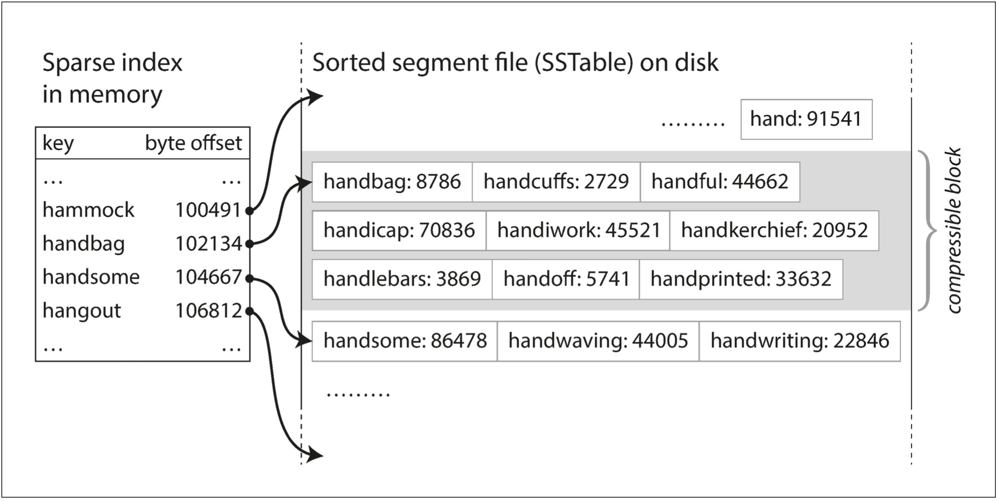

# 各类索引

许多数据库内部都使用日志（log），日志是一个仅支持追加式更新的数据文件。

在数据库领域中，日志表示一个仅能追加的记录序列集合。

有多种不同类型的索引，它们背后的基本想法都是保留一些额外的元数据，这些元数据作为路标，帮助定位想要的数据。

如果希望用几种不同的方式搜索相同的数据，在数据的不同部分，我们可以定义多种不同的索引。

由于每次写数据时，需要更新索引，因此任何类型的索引通常都会降低写的速度。

适当的索引可以加速读取查询，但每个索引都会减慢写速度。为此，数据库默认不会对所有内容创建索引，目的是为应用程序提供最有利加速的同时，避免引入过多不必要的开销。

## 哈希索引

Hash Table Index + Append log

讲解哈希索引是以key-value类型的数据为例。

在内存中维护**所有key**的一个hash table。在这个hash table中，key就对应数据的key，value是数据在文件中的特定偏移量。

注意，所有的key都应该放入内存中的hash table。但value的数据量是可以超过内存大小的，只需要一次磁盘寻址，就可以将value从磁盘加载到内存。

数据存储全部采用追加式文件组成。每当追加新的key-value对时，还有更新hash table中key对应的地址偏移量（包括增加新的key和更新已存在的key）。当查找某个值时，先根据key在hash table中定位文件中的偏移量，即存储位置，然后从文件中读取内容。

这样的存储引擎非常适合每个key的值频繁更新的场景，即每个key都有大量的写操作，但没有太多不同的key，这样讲全部key保存在内存是可行的。

#### 日志分段

整个数据日志文件会分成多个一定大小的段，单个段文件到达一定大小时就关闭它，并讲后续数据写入到新的段文件中。

可以对关闭的段文件执行压缩操作，压缩意味着在日志中丢弃重复的key，只保留每个key最新的更新。

由于一个段文件在经过压缩后会变得更小，所以在压缩过程中可以将多个段文件合并成一个段文件。合并的段文件数据会被写入到一个全新的段文件。

对段文件的压缩和合并过程可以在后台线程中完成。

当合并和压缩过程结束后，读取请求会被切换到新的段文件上，旧的段文件就可以被安全删除了。

#### 读取段文件数据

每个段文件都有自己的内存hash table，将key映射到文件的偏移量。

为了读取一个key的值，首先检查最新段的hash table，如果key不存在，则检查第二最新段的hash table，以此类推。

#### 删除记录

如果要删除一个key，则会在数据文件中追加一个针对那个key的墓碑标记。当合并段文件时，一旦发现墓碑标记，则会丢弃那个key的多有值。

#### 哈希索引优点

追加日志看起来很浪费空间，为什么不原地更新文件，最新值直接覆盖旧值？

- 追加日志和分段合并主要是**顺序写**，它通常比随机写快得多。
- 合并旧段可以避免随着时间的推移数据文件出现碎片化的问题。

#### 哈希索引缺点

- 所有key都需要放入内存中的hash table，如果不重复key的数量太多就不行了。
- 区间查询效率差。

## SSTables

在前面讲解中，日志文件中的key-value是按照写入顺序排列，对于同一个key，后出现的值优先于之前的值。除此之外，日志文件中key-value的顺序并不重要。

现在要求key-value的顺序按key排序，这就是**SSTable（Sorted String Table）**。

#### SSTable优点

- 合并段更加简单高效，可以使用类似合并排序的算法轻松合并多个文件。
  一个段包含在某个时间段内写入的所有key-value，一个段中的所有key-value肯定比其它段中的所有key-value更新。当多个段包含相同的key时，只保留最新段中的key-value，并丢弃旧段中的key-value。
- 由于key是按顺序排列的，这样就可以利用**稀疏索引**，而不必在内存中保存所有key的索引。
  

#### 如何让数据按key排序

写入可能以任意顺序出现。

内存排序利用树状数据结构实现，例如红黑树或AVL树。使用这些数据结构，可以按任意顺序插入key并以排序后的顺序读取它们。

SSTable存储引擎的工作流程如下：

1. 写入一个key-value时，将其添加到内存中的平衡树数据结构中。这个内存中的树也叫做内存表。
2. 当内存表大于某个阈值（通常为几MB字节）时，将其作为SSTable文件写入磁盘。由于key在树中是有序排列的，所以写磁盘可以很高效。
3. 当SSTable写磁盘的同时，新的写请求的key-value会被添加到一个**全新**的内存表中。
4. 当收到一个读请求时，首先尝试在内存表中查找key，然后是最新的磁盘段文件，接下来是次新的磁盘段文件，以此类推，直到找到目标（或为空）。
5. 后台进程周期性地执行段合并与压缩过程。

为了防止数据库崩溃时丢失数据，可以在磁盘上保留单独的日志，每个写操作都会立即记录到该日志。

这个日志文件不需要按key排序，每当将内存表写入到SSTable时，这个日志就可以被丢弃了。

Lucene、Cassandra和HBase都利用类似的算法实现存储引擎。

#### 性能优化

当查找的key不存在时，在确定key不存在之前，必须先检查内存表，然后需要从新到旧检查每个段文件，这会导致多次磁盘读取。

为了优化这种访问，存储引擎通常使用额外的布隆过滤器，用于快速判断一个key是否存在。

## B-tree

B-tree是几乎所有关系数据库中的标准索引实现，当然许多非关系型数据库也经常使用。

B-tree中的key-value对也是按照key排序的，这样可以实现高效的key-value查找和区间查询。

B-tree并没有将数据文件划分成多个段。

B-tree将数据库分解成固定大小的块或页，通常大小为4KB（有时更大），页是内部读/写的最小单元。这种设计更接近底层硬件，因为磁盘也是以固定大小的块排列。

每个页面都可以使用地址进行标识，一个页面可以引用另一个页面，类似指针，不过是指向磁盘地址，不是内存。

这些页面引用构造了一个树状结构：

某一页被指定为B-tree的根，当查找索引中一个key时，总是从根开始。

如果要更新B-tree中现有key的值，首先搜索包含该key的叶子页，更改该页的值，并将页写回到磁盘。

如果是添加新的key，则需找到其范围包含新key的页，并将新的key添加到该页。

如果页中没有足够的可用空间来容纳新的key，则会发生页分裂，此时父页也需要被更新：

B-tree底层的基本写操作是使用新数据覆盖磁盘上的旧页。

某些操作需要覆盖多个不同的页。例如，如果添加数据导致页溢出，就需要分裂页，就需要写两个分裂的页，并且还需要修改其父页以更新对两个子页的引用。

预写日志（write-ahead log，WAL），也称为redo日志。是一个仅支持追加修改的文件，每个B-tree的修改必须先更新WAL然后再修改树本身的页。当数据库在崩溃后需要恢复时，该日志用于将B-tree恢复到最近一致的状态。

## 对比B-tree和LSM-tree

LSM-tree通常对于写入更快，而B-tree对于读取更快。

由于碎片，B-tree存储引擎使某些磁盘空间无法使用。由于LSM-tree不是面向页的，并且定期重写SSTable以消除碎片化。

LSM-tree缺点

由于磁盘的并发资源有限，当磁盘执行昂贵的压缩操作时，很容易发生读写请求等待的情况。

对于LSM-tree，要确保段文件压缩合并的速率跟得上写操作的速率。

日志结构化存储引擎的查询响应时间有时会相当高，而B-tree的响应延迟则更具确定性。

