# Hive

## 数据库

### 默认存储路径

在Hive中，数据库的本质就是 HDFS 上的一个**文件夹**。默认数据库在HDFS上的存放路径是在`/user/hive/warehouse`下.

默认情况下，Hive会自带一个名为 default 的数据库，default 数据库所在路径就是 `/user/hive/warehouse`。

可以通过下面两种方式查看一个数据库的信息：

```hive
1. show create database default;
```

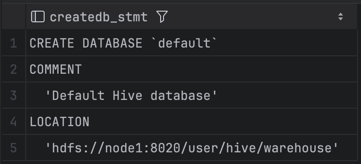

```hive
2. desc database default;
```

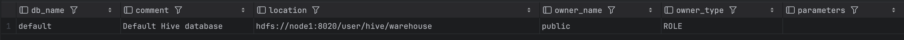

对于其它数据库，其对应文件夹所在的路径是 `/user/hive/warehouse/${databaseName}.db`。

如下SQL创建一个名为myhive的database：

```hive
create database myhive;
```

则该database对应的文件夹所在的路径是：

```shell
/user/hive/warehouse/myhive.db
```

### 指定location

使用`location`关键字，可以指定数据库在HDFS上的存储路径：

```hive
create database test_location location '/dw/test_location';
```

`test_location`数据库对应的文件夹会存储在HDFS上的 `/dw/test_location` 路径下。

总结：

1. Hive的数据库在HDFS上就是一个以`.db`结尾的目录。
2. 默认存储在：/user/hive/warehouse内。
3. 可以通过`location`关键字在创建数据库的时候为其指定存储目录。

### 删除数据库

```hive
-- 删除一个空数据库，如果数据库下面有数据表，那么就会报错
drop database myhive;

-- 强制删除数据库，包含数据库下面的表一起删除
drop database myhive cascade;
```

## 数据表

一个数据表的本质也是HDFS上的一个**文件夹**。

### 基础建表

创建表的Hive SQL结构如下（`[]`表示可选）：

```hive
CREATE [EXTERNAL] TABLE tb_name
  (col_name col_type [COMMENT col_comment], ......)
  [COMMENT tb_comment]
  [PARTITIONED BY(col_name, col_type, ......)]
  [CLUSTERED BY(col_name, col_type, ......) INTO num BUCKETS]
  [ROW FORMAT DELIMITED FIELDS TERMINATED BY '']
  [STORED AS file_format]
  [LOCATION 'path']
  [TBLPROPERTIES (property_name=property_value, ...)];
```

1. `EXTERNAL`用于声明一个数据表是外部表。未被`EXTERNAL`关键字修饰的是内部表。
2. 当声明一个表是外部表时，必须使用`LOCATION`指定数据表的路径。
3. `ROW FORMAT DELIMITED FIELDS TERMINATED BY` 指定各个列在数据文件中的分隔符。默认分隔符是`\001`，不是可见字符，某些文本编辑器中会显示`SOH`。
4. `[PARTITIONED BY(col_name, col_type, ......)]`基于列分区。
5. `[CLUSTERED BY(col_name, col_type, ......) INTO num BUCKETS]`基于列分桶。
6. `STORED AS` 用于指定表的数据存储格式。
7. `TBLPROPERTIES` 用于指定表的一些额外属性，这些属性可以为表的管理、优化和使用提供更多的控制和信息。

### 其它建表方式

基于其它表的结构建表：

```hive
CREATE TABLE tbl_name LIKE other_tbl;
```

基于查询结果建表：

```sql
CREATE TABLE tbl_name AS SELECT ...;
```

### 内部表

未被external关键字修饰的表即是内部表。 内部表数据存储的位置是在其数据库的文件夹内。例如，如下Hive SQL创建的数据表`test1210`，其数据文件的存储位置是在`/dw/test_location/test1210`内。

```hive
create database test_location location '/dw/test_location';
use test_location;

create table test1210
(
    a string,
    b string
) row format delimited fields terminated by ',';
-- 明确指定在表的数据文件中，各个列的值使用","分隔
```

删除内部表会直接删除元数据（metadata）及其数据文件。

### 外部表

被external关键字修饰的表即是外部表。外部表是指表的数据可以存放在任何位置，通过LOCATION关键字指定。

在删除外部表的时候， 仅仅是删除元数据（表的信息），表数据本身不会被删除。

外部表本身和其数据是相互独立的：

1. 可以先有表，然后把数据移动到表指定的`location`中。
2. 也可以先有数据，然后创建外部表通过location指向数据。
3. 删除表，表不存在了但数据文件还在。

创建外部表时，必须使用`row format delimited fields terminated by`指定列分隔符，必须使用`location`指定数据路径。

内部表和外部表可以互相转换。

### 分区表

一个分区，就是一个单独的文件夹。

Hive支持根据多个字段进行分区，多分区是以层次结构组织的目录树。

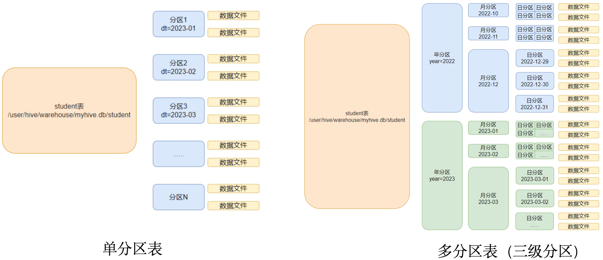

创建一张多级分区表：

```hive
create table score(
    s_id string,
    c_id string,
    s_score int
) partitioned by (year string, month string, day string)
row format delimited fields terminated by '\t';
```

通过`load`命令向表中导入数据：

```hive
load data inpath '/test_hive/score.txt' into table score
    partition (year='2024', month='10', day='29');
		-- 使用partition关键字明确指定向哪个分区导入数据
```

通过`insert into`向表中加入数据：

```hive
-- 使用partition关键字明确指定向哪个分区增加数据
INSERT INTO TABLE score PARTITION (year='2024', month='12', day='11')
VALUES ('001', 'C001', 85),
       ('002', 'C002', 90),
       ('009', 'C001', 82),
       ('010', 'C003', 95);
```

多次向表中导入数据后，该表在HDFS上的目录结构：

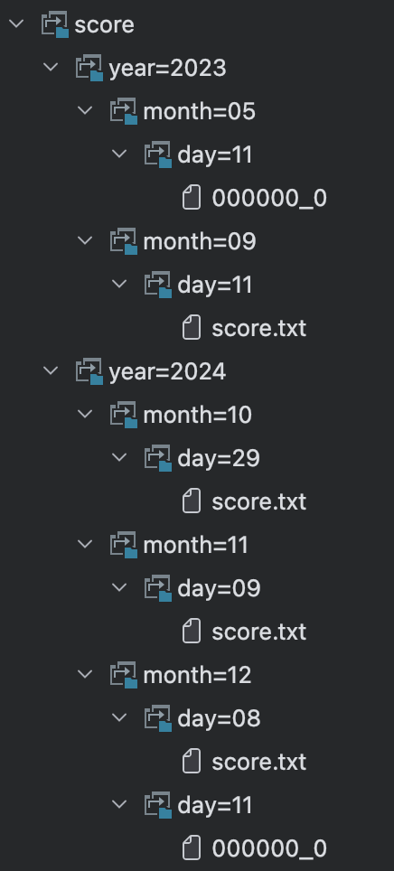

数据文件中的数据存储格式如下，可以看到数据文件中不包括`year, month, day`这三个字段：

```
张三	语文	66
李四	数学	77
王五	语文	88
赵六	数学	86
```

在通过`Select SQL`查询时，可以看到分区列以及对应的数据：

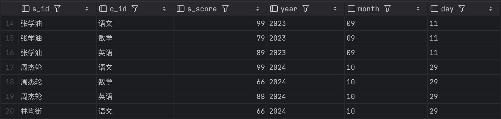

通过`alter`命令删除一个分区：

```hive
alter table score drop partition(year='2024', month='12', day='11')
```

### 分桶表

分桶是将表中的数据拆分到**固定数量**的不同文件中进行存储。

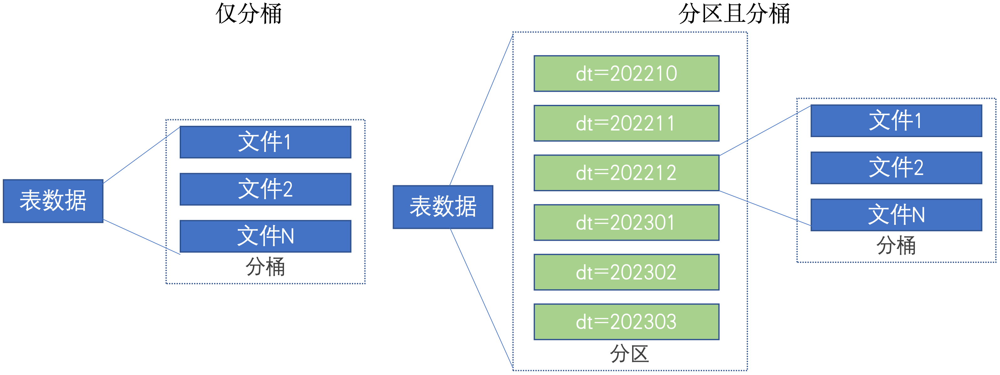

分桶是对数据按照某个字段进行**哈希计算**，然后根据哈希值将数据分散存放到固定数量的 “桶”（文件）中。

要创建分桶表，需要开启如下配置：

```hive
set hive.enforce.bucketing=true;
```

创建分桶表并加入数据：

```hive
-- 创建一个分桶表，按照user_id字段分桶，桶的数量为4
CREATE TABLE bucketed_users (
  user_id INT,
  name STRING
) CLUSTERED BY (user_id) INTO 4 BUCKETS
row format delimited fields terminated by ',';

-- 向分桶表中加入数据
INSERT INTO TABLE bucketed_users
VALUES
(1, 'Alice'),
(2, 'Bob'),
...
(20, 'Tom');
```

表中的数据会分散到4个文件中存储：

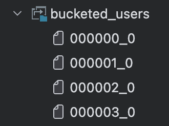

每个文件的数据存储格式如下，可见数据文件中并不包含分区信息：

```
7,Grace
10,Jack
2,Bob
17,Queen
6,Frank
```

分桶表不能通过`load`命令进行数据加载，只能通过`insert`。

这是因为分桶表需要根据某个字段进行Hash计算，不能简单的通过移动数据文件进行数据加载，所以必须启动MapReduce。

### 事务表

默认配置下，Hive中的表是不支持`Update`或`Delete`操作的：

```hive
update score set s_score = 100 where s_id = '001';

-- 如下是执行这行Update操作的报错信息
[42000][10294] Error while compiling statement: FAILED: SemanticException [Error 10294]: Attempt to do update or delete using transaction manager that does not support these operations.
```

要想让表支持修改操作，需要满足如下条件：

1. 仅支持ORC文件格式（STORED AS ORC）。    
2. 默认情况下事务配置为关闭，需要配置参数开启使用。
3. 表必须是分桶表才可以使用事务功能。   
4. 表参数transactional必须为true。
5. 不允许从非事务会话读取/写入事务表。

```hive
-- 开启事务配置，可以使用set设置当前session生效，也可以配置在hive-site.xml中
set hive.support.concurrency = true;
set hive.txn.manager = org.apache.hadoop.hive.ql.lockmgr.DbTxnManager;

-- 创建事务表，并加入数据
create table test_tx(
    id int,
    name String,
    age int
) clustered by (id) into 2 buckets
stored as orc
TBLPROPERTIES('transactional'='true');

INSERT INTO TABLE test_tx
VALUES
(1, 'Alice', 25),
...
(5, 'Eve', 45);

-- 更新数据
update test_tx set age = 100 where id = 1;

-- hive在执行update操作的时候，实际上是先执行delete，再加入一条新的数据。
```

test_tx表在HDFS上的文件存储结构：

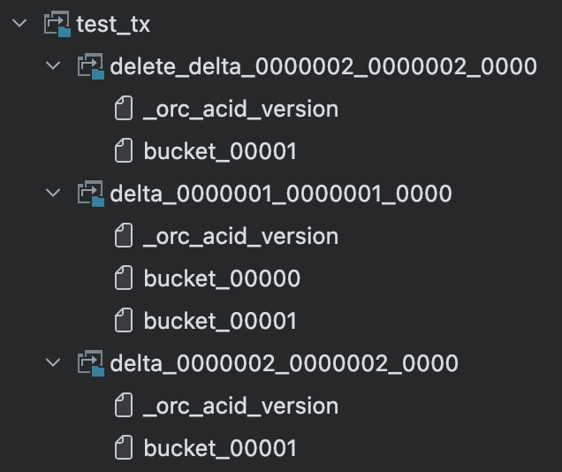

delta_0000001是insert操作对应的数据文件，在执行update操作后，delete_delta和delta_0000002被加入进来。

delta_0000002下的bucket_00001文件的内容：

```
operation,originalTransaction,bucket,rowId,currentTransaction,row
0,2,536936448,0,2,{"id": "1", "name": "Alice", "age": "100"}
```

可以看到虽然只是update了一个值，但增加了一整行的数据（虽然是orc格式的数据，但IDEA可以查看文件内容）。

我重启了一下IDEA，这样session就不再是事务会话了，然后就不能再查询`test_tx`表的数据了。事务表的功能很鸡肋。

## 加载数据

### LOAD 文件

使用`LOAD`语法，从外部将数据加载到Hive内。

```hive
LOAD DATA [LOCAL] INPATH 'filepath' [OVERWRITE] INTO TABLE tablename;
```

LOCAL： 声明数据是否在本地。使用local，表明数据不在HDFS，加载的数据文件是在本机，需使用`file://`协议指定路径。
		不使用local，表示数据在HDFS上，可以使用`HDFS://`协议指定路径。

**基于HDFS进行load加载数据，源数据文件会消失**，本质上是将数据文件从原路径移动到表所对应的目录中。

### INSERT SELECT

```hive
INSERT [OVERWRITE | INTO] TABLE tablename1 [PARTITION (partcol1=val1, partcol2=val2 ...) [IF NOT EXISTS]] 
select_statement1 FROM from_statement;
```

将SELECT查询语句的结果插入到其它表中，被SELECT查询的表可以是内部表或外部表。

示例：

```hive
-- INTO关键字要带着
INSERT INTO TABLE tbl1 SELECT * FROM tbl2;

-- OVERWRITE表示覆盖的意思，即当执行该语句时，会先删除目标表tbl1中的原有数据，然后再将从tbl2中查询出来的结果集插入到tbl1中。
INSERT OVERWRITE TABLE tbl1 SELECT * FROM tbl2;
```

### 数据导出

可以将hive表中的数据导出到`linux`本地磁盘、HDFS、`Mysql`等等。

例如，将查询的结果导出到`HDFS`上：

```hive
insert overwrite directory '/tmp/export' row format delimited fields terminated by '\t' select * from test_load;
```

## 复杂类型

### array

```hive
create table test_array(
    name string,
    work_locations array<string>
) row format delimited fields terminated by '\t'
COLLECTION ITEMS TERMINATED BY ',';
```

注意！field的分隔符不能与collection的分隔符相同。

各个列之间由`\t`分隔，数组中各个元素之间由`,`分隔，数据文件中的数据格式如下：

```
张三	北京,上海
李四	广州,深圳
王五	杭州,南京
```

向`test_array`表中增加数据的`insert sql`如下：

```hive
INSERT INTO TABLE test_array(name, work_locations)
VALUES
('张三', array('北京','上海')),
('李四', array('广州','深圳'));
```

利用数组下标执行查询：

```hive
select name, work_locations[0] as first_city, work_locations[1] as second_city from test_array;
```


使用`size`函数计算数组中元素的数量：

```hive
select name, size(work_locations) as location_num from test_array;
```


### map

```hive
create table test_map(
    id int,
    name string,
    schools map<string, string>
) row format delimited fields terminated by ','
COLLECTION ITEMS TERMINATED BY '#'
MAP KEYS TERMINATED BY ':';

INSERT INTO TABLE test_map (id, name, schools)
VALUES
(1, '张三', map('Primary School', '红星小学', 'Junior High School', '阳光中学', 'Senior High School', '实验高中')),
...
```

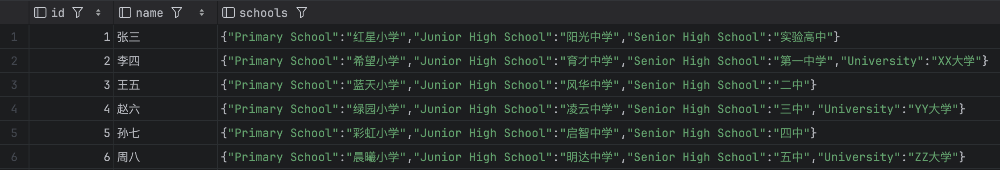

数据文件中的数据格式如下：

```
1,张三,Primary School:红星小学#Junior High School:阳光中学#Senior High School:实验高中
2,李四,Primary School:希望小学#Junior High School:育才中学#Senior High School:第一中学#University:XX大学
3,王五,Primary School:蓝天小学#Junior High School:风华中学#Senior High School:二中
4,赵六,Primary School:绿园小学#Junior High School:凌云中学#Senior High School:三中#University:YY大学
5,孙七,Primary School:彩虹小学#Junior High School:启智中学#Senior High School:四中
6,周八,Primary School:晨曦小学#Junior High School:明达中学#Senior High School:五中#University:ZZ大学
```

查询map类型数据示例：

```hive
select id, name, schools['Primary School'] as primary_school, schools['University'] as university from test_map 
where size(schools) == 4;
```

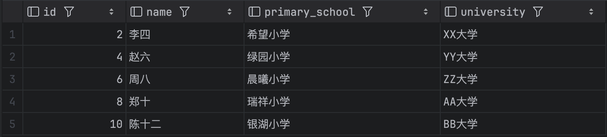

### struct

```hive
create table test_struct(
    id string,
    info struct<name:string, age:int>
) row format delimited fields terminated by ','
collection items terminated by ':';

INSERT INTO TABLE test_struct (id, info)
VALUES
('001', named_struct('name', '张三', 'age', 20)),
...
```

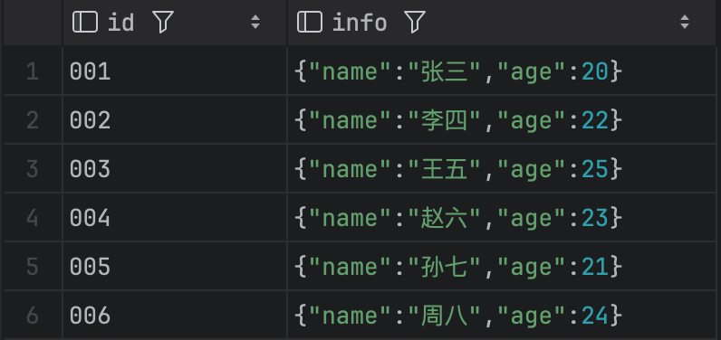

数据文件中的数据格式如下：

```hive
001,张三:20
002,李四:22
003,王五:25
004,赵六:23
005,孙七:21
006,周八:24
```

查询struct类型数据示例：

```hive
select id, info.name, info.age from test_struct;
```

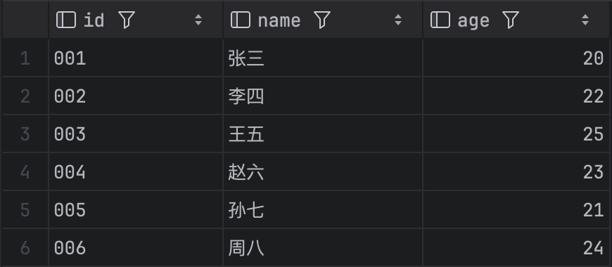

## 文件存储格式

Hive提供的文件存储格式包括：TextFile、SequenceFile、ORC (Optimized Row Columnar)、Parquet等。

文件格式在建表的时候指定，默认是TextFile。可以通过`STORED AS`对文件格式进行设置。

### TextFile

TextFile是Hive中默认的文件格式，按**行**存储数据。

几乎所有的原始数据生成都是纯文本格式，所以Hive为了避免各种编码及数据错乱的问题，选用了TextFile作为默认的格式。

TextFile的缺点如下：

1. 耗费存储空间。
2. 按行存储，读取列的性能差。

TextFile一般用于做`ODS`层数据加载。通过load命令直接将数据加载到表中。

```hive
create table tb_sogou_source
(
    stime      string,
    userid     string,
    keyword    string,
    clickorder string,
    url        string
) row format delimited fields terminated by '\t';

load data inpath '/test_hive/SogouQ.reduced' into table tb_sogou_source;
```

查询`tb_sogou_source`如下所示：

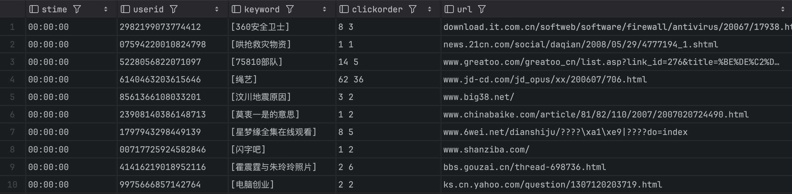

### SequenceFile

SequenceFile是Hadoop里用来存储序列化的**键值对**即**二进制**的一种文件格式。SequenceFile文件也可以作为MapReduce作业的输入和输出，hive也支持这种格式。

优点：

1. 以二进制的KV形式存储数据与底层交互更加友好，性能更快可压缩、可分割。
2. 优化磁盘利用率和I/O可并行操作数据，查询效率高。

缺点：

1. 存储空间消耗最大
2. 与非Hadoop生态系统之外的工具不兼容

```hive
create table tb_sogou_seq
(
    stime      string,
    userid     string,
    keyword    string,
    clickorder string,
    url        string
) row format delimited fields terminated by '\t'
stored as sequencefile;

insert into table tb_sogou_seq 
select * from tb_sogou_source;
```

### Parquet

Parquet是一种支持**嵌套结构**的**列式存储**文件格式。

适用于字段数非常多，无更新，只取部分列的查询。

优点：

1. 高效的数据编码和压缩。可压缩、可分割。
2. 优化磁盘利用率和I/O。
3. 可用于多种数据处理框架。

缺点：

不支持update, insert, delete

```hive
create table tb_sogou_parquet
(
    stime      string,
    userid     string,
    keyword    string,
    clickorder string,
    url        string
) row format delimited fields terminated by '\t'
stored as parquet;

insert into table tb_sogou_parquet select * from tb_sogou_source;
```

### ORC

ORC（OptimizedRC File）也是一种**列式存储**文件格式。

ORC最初就**产生自Apache Hive**，用于降低Hadoop数据存储空间和加速Hive查询速度。

ORC适用于Hive中大型的存储、查询。

优点：

1. 列式存储。
2. 存储效率非常高。
3. 可压缩。
4. 支持索引，支持矢量化查询。

缺点：

1. 加载时性能消耗较大。
2. 需要通过text文件转化生成。
3. 读取全量数据时性能较差。

```hive
create table tb_sogou_orc
(
    stime      string,
    userid     string,
    keyword    string,
    clickorder string,
    url        string
) row format delimited fields terminated by '\t'
stored as orc;

insert into table tb_sogou_orc select * from tb_sogou_source;
```
ORC格式的压缩比非常高，同样的数据，ORC格式只有32.65MB，而其它三种格式都在140MB以上。
其中占用空间最大的是SequenceFile格式，占用173.33MB的空间。一般规定Hive使用ORC存储格式。


# Hive部署
1. 先安装Mysql
2. 修改hive中的配置文件，要告诉hive HADOOP_HOME和mysql地址等信息。
3. 将mysql的驱动jar放入lib文件夹内。
4. 执行如下命令初始化mysql，这个命令会在mysql中创建所有跟元数据相关的表。
    ```shell
    ./schematool -initSchema -dbType mysql -verbos
    ```
5. 启动metastore服务,执行如下命令：
   ```shell
   nohup ./bin/hive --service metastore >> logs/metastore.log 2>&1 &
   ```
6. 执行命令`./bin/hive`启动hive shell，此时就可以通过hive shell操作hive数据库了。但其它客户端工具还无法远程连接的hive。
7. 要想让其它客户端工具远程连接到hive，需要启动hiveserver2，这是一个ThriftServer。启动命令如下：
    ```shell
    nohup ./bin/hive --service hiveserver2 >> logs/hiveserver2.log 2>&1 &
    ```

# HDFS中的三个角色
NameNode, DataNode, SecondaryNameNode

`start-dfs.sh` 一键启动hdfs集群

`stop-dfs.sh` 一键关闭hdfs集群

hdfs系统的管理网页： `http://node1:9870`

## SecondaryNameNode
NameNode基于多个edits和一个fsimage文件的配合完成整个文件系统元数据的管理和维护。

edits文件是一个流水账文件，记录了hdfs中的每一次操作，以及每次操作影响的文件及其对应的block。

当一个edits文件中的数据到达一定量时，数据就会被记录到另一个新的edits文件中。所以在某一个时刻可能会存在多个edits文件。

当用户要查找某个文件时，NameNode需要遍历所有的edits文件以确定要查找文件的最终状态。如果edits文件数量非常多，这势必会影响文件的查询效率。**所以需要合并edits文件， 将多个对相同文件的操作合并，只保留文件的最终状态**。

将多个edits文件合并后，得到的文件系统最终的描述文件就是**fsimage**文件。
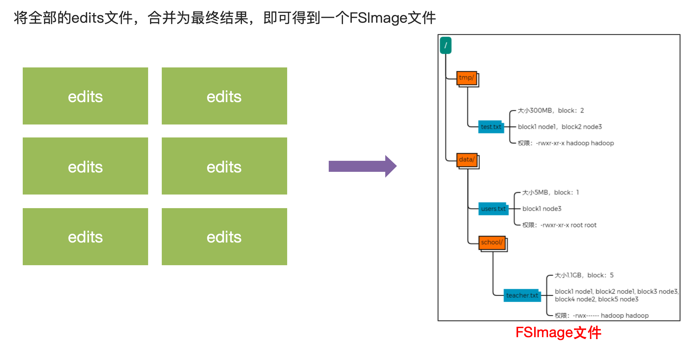

NameNode基于edits和FSImage的配合，完成整个文件系统元数据的管理。
1. 每次对HDFS的操作，均被edits文件记录
2. edits文件达到大小上限后，开启新的edits文件记录后续对HDFS的操作。
3. 定期进行edits文件的合并操作。如当前没有fsimage文件，将全部edits文件合并为第一个fsimage。如果当前已存在fsimage文件，将全部edits和已存在的fsimage进行合并，形成新的fsimage。


对于元数据的合并，是一个定时过程，它基于如下三个配置：
1. `dfs.namenode.checkpoint.period`, 默认3600秒，即一小时合并一次。
2. `dfs.namenode.checkpoint.txns`, 默认1000000，即100W次事务合并一次。这两个条件哪个先满足都会触发merge。
3. `dfs.namenode.checkpoint.check.period` 检查是否到达merge的条件，默认60秒。


SecondaryNameNode的职责就是执行元数据的合并：

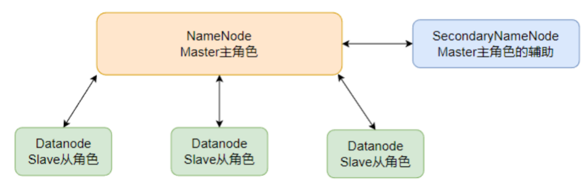

SecondaryNameNode会通过http从NameNode拉取数据，包括edits和fsimage。合并完成后再返回给NameNode使用。


# YARN
YARN中出了ResourceManager和NodeManager以外，还有ProxyServer和JobHistoryServer两个组件。

JobHistoryServer 记录历史运行的程序的信息以及产生的日志并提供WEB UI站点供用户使用浏览器查看。

`start-yarn.sh` 一键启动所有的ResourceManager、NodeManager 和 ProxyServer。

`mapred --daemon start historyserver` 启动 JobHistoryServer。

通过如下命令提交一个jar到hadoop集群中：
```shell
hadoop jar 程序文件 java类名 [程序参数] ... [程序参数]
```


