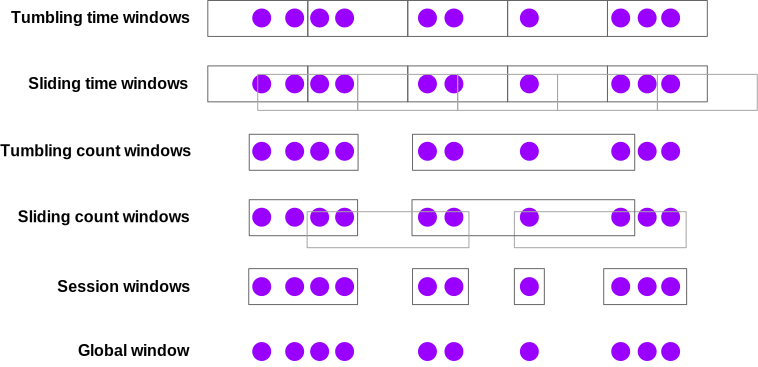

## Event Time

Flink支持三种不同的时间概念：

- **事件时间(event time)**：事件发生的时间，由产生该事件的设备记录。
- **摄取时间(ingestion time)**：Flink在摄取该事件时记录的时间戳。
- **处理时间(processing time)**：job graph中的operator处理该事件时的时间。

为了得到可复现的结果，你应当使用event time。这样一来，处理结果将不会依赖于计算的执行时间。

基于processing time计算分析结果会导致不一致性，并且会使重新分析历史数据变得困难。

如果你想要使用event time，你必须提供一个**时间戳提取器(Timestamp Extractor)**和**Watermark**生成器。Timestamp Extractor用于从event中提取时间，wartermark则用于判断事件的处理进度。

## Watermarks

你有一个带有时间戳的事件流，这些事件的**到达顺序有些混乱**，如下所示：

```java
··· 23 19 22 24 21 14 17 13 12 15 9 11 7 2 4 →
```

所显示的数字是时间戳，它们表明这些事件**实际发生的时间**。第一个到达的事件发生在时间4，随后是一个发生在更早时间(时间 2)的事件，依此类推。

现在想象一下你正在尝试创建一个`stream sorter`。它会在stream中的每个事件到达时对其进行处理，并发出一个包含相同事件的新stream，不过新stream中的事件是按照它们的时间戳**排序**的。

**You need some sort of policy that defines when, for any given timestamped event, to stop waiting for the arrival of earlier events.**

**这正是watermark的作用所在—— 它定义了何时停止等待更早的事件**。

Event time processing in Flink depends on **watermark generators** that **insert special timestamped elements into the stream, called *watermarks*.** 

一个时间戳为`t`的wartermark表示在时间 t 之前发生的所有事件**很可能**已经全部到达。

When should this stream sorter stop waiting, and push out the 2 to start the sorted stream? When a watermark arrives with a timestamp of 2, or greater.

### Different policies for deciding how to generate watermarks

One simple approach is to assume that these delays are bounded by some maximum delay. Flink refers to this strategy as ***bounded-out-of-orderness*** watermarking.  It is easy to imagine more complex approaches to watermarking, but **for most applications a fixed delay works well enough**.

### Latency vs. Completeness

Another way to think about watermarks is that they give you, the developer of a streaming application, control over the tradeoff between latency and completeness. Unlike in batch processing, where one being able to have complete knowledge of the input before producing any results, with streaming you must eventually stop waiting to see more of the input, and produce some sort of result.

You can either configure your watermarking aggressively, with a short bounded delay, and thereby take the risk of producing results with rather incomplete knowledge of the input – i.e., a possibly wrong result, produced quickly. Or you can wait longer, and produce results that take advantage of having more complete knowledge of the input stream(s).

It is also possible to implement hybrid solutions that produce initial results quickly, and then supply updates to those results as additional (late) data is processed.

### Lateness

Lateness is defined relative to the watermarks. A `Watermark(t)` asserts that the stream is complete up through time *t*; any event following this watermark whose timestamp is ≤ *t* is **late**.

### Working with Watermarks

In order to perform event-time-based event processing, Flink needs to know the **time associated with each event**, and it also needs **the stream to include watermarks**.

It is usually done by implementing a class that extracts the timestamps from the events, and generates watermarks on demand. The easiest way to do this is by using a `WatermarkStrategy`:

```java
DataStream<Event> stream = ...;

// 允许事件最多延迟 20 秒到达，以处理可能的乱序数据。
// 指定了事件时间戳提取器，从 Event 对象中提取 timestamp 字段作为事件发生的时间戳。
WatermarkStrategy<Event> strategy = WatermarkStrategy
        .<Event>forBoundedOutOfOrderness(Duration.ofSeconds(20))
        .withTimestampAssigner((event, timestamp) -> event.timestamp);

DataStream<Event> withTimestampsAndWatermarks =
    stream.assignTimestampsAndWatermarks(strategy);
```

## Windows

在进行流处理时，对数据流的**有界子集(bounded subsets)**进行聚合计算分析是很常见的操作。例如处理如下问题：

- **每分钟**的页面浏览量
- 每个用户**每周**的会话次数
- 每个传感器**每分钟**的最高温度

Computing windowed analytics with Flink depends on two principal abstractions:

- ***Window Assigners*** that assign events to windows (creating new window objects as necessary)
- ***Window Functions*** that are applied to the events assigned to a window

Window assigner将时间分配给一个恰当的窗口，window function对一个窗口内的数据做聚合分析计算。

```java
stream
    .keyBy(<key selector>)
    .window(<window assigner>)
    .reduce|aggregate|process(<window function>);
```

You can also use windowing with non-keyed streams, but keep in mind that in this case, the processing will ***not* be done in parallel**:

由于stream没有基于key进行分区，所以只能由一个节点做全局的窗口聚合计算。`windowAll`操作会导致各个节点将数据发送给一个节点。

```java
stream
    .windowAll(<window assigner>)
    .reduce|aggregate|process(<window function>);
```

### Window Assigners

Flink has several built-in types of window assigners, which are illustrated below:



- **Tumbling time windows(滚动时间窗口)**
  - *page views per minute*
  - `TumblingEventTimeWindows.of(Time.minutes(1))`
- **Sliding time windows(滑动时间窗口)**
  - *page views per minute computed every 10 seconds*
  - `SlidingEventTimeWindows.of(Time.minutes(1), Time.seconds(10))`
- **Session windows(会话窗口)**
  - page views per session, where sessions are defined by a gap of at least 30 minutes between sessions
  - `EventTimeSessionWindows.withGap(Time.minutes(30))`

Durations can be specified using one of `Time.milliseconds(n)`, `Time.seconds(n)`, `Time.minutes(n)`, `Time.hours(n)`, and `Time.days(n)`.

When working with count-based windows, keep in mind that these windows will not fire until a batch is complete. There’s no option to time-out and process a partial window, though you could implement that behavior yourself with a custom Trigger.

A global window assigner assigns every event to the same global window. This is only useful if you are going to do your own custom windowing, with a custom Trigger. 

### Window Functions

You have three options for how to process the contents of your windows:

1. as a batch, using a `ProcessWindowFunction` that will be passed an `Iterable` with the window’s contents;
2. incrementally, with a `ReduceFunction` or an `AggregateFunction` that is called as each event is assigned to the window;
3. or with a combination of the two, wherein the pre-aggregated results of a `ReduceFunction` or an `AggregateFunction` are supplied to a `ProcessWindowFunction` when the window is triggered.

Here are examples of approaches 1 and 3. Each implementation finds the peak value from each sensor in 1 minute event time windows, and producing a stream of Tuples containing `(key, end-of-window-timestamp, max_value)`.

#### ProcessWindowFunction Example

```java
DataStream<SensorReading> input = ...;

input
    .keyBy(x -> x.key)
    .window(TumblingEventTimeWindows.of(Time.minutes(1)))
    .process(new MyWastefulMax());

public static class MyWastefulMax extends ProcessWindowFunction<
        SensorReading,                  // input type
        Tuple3<String, Long, Integer>,  // output type
        String,                         // key type
        TimeWindow> {                   // window type
    
    @Override
    public void process(
            String key,
            Context context, 
            Iterable<SensorReading> events,
            Collector<Tuple3<String, Long, Integer>> out) {

        int max = 0;
        for (SensorReading event : events) {
            max = Math.max(event.value, max);
        }
        out.collect(Tuple3.of(key, context.window().getEnd(), max));
    }
}
```

All of the events assigned to the window have to be buffered in keyed Flink state until the window is triggered. This is potentially quite expensive.

#### Incremental Aggregation Example

```java
DataStream<SensorReading> input = ...;

input
    .keyBy(x -> x.key)
    .window(TumblingEventTimeWindows.of(Time.minutes(1)))
    .reduce(new MyReducingMax(), new MyWindowFunction());

private static class MyReducingMax implements ReduceFunction<SensorReading> {
    public SensorReading reduce(SensorReading r1, SensorReading r2) {
        return r1.value() > r2.value() ? r1 : r2;
    }
}

private static class MyWindowFunction extends ProcessWindowFunction<
    SensorReading, Tuple3<String, Long, SensorReading>, String, TimeWindow> {

    @Override
    public void process(
            String key,
            Context context,
            Iterable<SensorReading> maxReading,
            Collector<Tuple3<String, Long, SensorReading>> out) {

        SensorReading max = maxReading.iterator().next();
        out.collect(Tuple3.of(key, context.window().getEnd(), max));
    }
}
```

Notice that the `Iterable<SensorReading>` will contain exactly one reading – the pre-aggregated maximum computed by `MyReducingMax`.

## Late Events

**By default, when using event time windows, late events are dropped**. There are two optional parts of the window API that give you more control over this.

You can arrange for the events that would be dropped to be collected to an alternate output stream instead, using a mechanism called **Side Outputs**. Here is an example of what that might look like:

```java
OutputTag<Event> lateTag = new OutputTag<Event>("late"){};

SingleOutputStreamOperator<Event> result = stream
    .keyBy(...)
    .window(...)
    .sideOutputLateData(lateTag)
    .process(...);
  
DataStream<Event> lateStream = result.getSideOutput(lateTag);
```

You can also specify an interval of *allowed lateness* during which the late events will continue to be assigned to the appropriate window(s) (**whose state will have been retained**). By default each late event will cause the window function to be called again.

**By default the allowed lateness is 0**. In other words, elements behind the watermark are dropped (or sent to the side output).

```java
stream
    .keyBy(...)
    .window(...)
    .allowedLateness(Time.seconds(10))
    .process(...);
```

When the allowed lateness is greater than zero, only those events that are so late that they would be dropped are sent to the side output (if it has been configured).

## Wartermark生成例子

假设Flink应用配置的是每10秒钟生成一次Watermark，允许的最大延迟时间是20秒。则如果source在一个生成周期看到时间戳是 t，那么此时生成的 Watermark 就是 `t - 20`。

下面的具体的例子：

- 在 `2024 年 10 月 1 日 10:10:00` 这个生成周期，source 端看到的最大时间戳时刻为 `2024 年 10 月 1 日 10:09:50`，那么此时生成的 Watermark 时间为 `2024 年 10 月 1 日 10:09:30`，即最大时间戳时刻减去 20 秒。
- 到了 2024 年 10 月 1 日 10:10:10 这个生成周期，若 source 端看到的最大时间戳时刻为 2024 年 10 月 1 日 10:10:05，则生成的 Watermark 时间为 2024 年 10 月 1 日 10:09:45。
- 到了 2024 年 10 月 1 日 10:10:20 这个生成周期，如果 source 端看到的最大时间戳时刻是 2024 年 10 月 1 日 10:10:15，则生成的 Watermark 为 2024 年 10 月 1 日 10:09:55。

