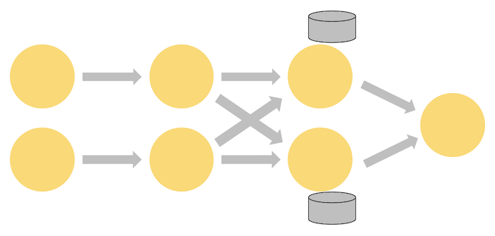

## 有状态的流式计算

在流式计算中，对一个事件（event）的处理常常依赖于对之前事件的处理结果。例如，计算每分钟事件发生的数量以及信用卡欺诈检测模型等场景，都需要维护事件的处理状态。

有状态operator的分布式集合实际上是一个**基于key分片的存储系统**。每个分片实例负责处理具有特定key的事件，这些key对应的状态会保存在**本地**，以便后续处理过程可以利用之前的信息。

下图展示了一个正在运行的Flink Job，该Job中的前三个operator以并行度2运行，最终将数据传输至并行度为1的sink operator。可以看到，第三个operator是有状态的，在第二个和第三个operator之间会进行shuffle操作：



TaskManager中处理事件的线程总是可以从**本地**访问状态数据，这使得Flink应用具有**高吞吐和低延迟**的特性。

你可以将状态保存在JVM堆上，但如果状态数据量太大，也可以将其存储在硬盘中。

## State Backend

Flink通过**State Backend**管理状态数据。有两种可用的State Backend实现：一种是基于**RocksDB**，它是一个嵌入式的`key-value`存储，会将状态数据保存在磁盘上；另一种是**基于堆内存的**State Backend，它会将状态数据存储在**内存中**，具体来说是存储在**Java堆上**。

| Name                        | Working State        | Snapshotting       | Comment                                                      |
| --------------------------- | -------------------- | ------------------ | ------------------------------------------------------------ |
| EmbeddedRocksDBStateBackend | Local disk (tmp dir) | Full / Incremental | 1. Supports state larger than available memory <br />2. 10x slower than heap-based backends |
| HashMapStateBackend         | JVM Heap             | Full               | 1. Fast, requires large heap <br />2. Subject to GC          |

Note that only the `EmbeddedRocksDBStateBackend` is able to do incremental snapshotting, which is a significant benefit for applications with large amounts of slowly changing state.


这两种state backend都能够进行异步快照操作，这意味着它们在进行快照时不会妨碍正在进行的流处理操作。

## Checkpoint Storage

Flink **periodically** takes persistent snapshots of **all the state in every operator** and copies these snapshots somewhere more durable, such as a distributed file system. In the event of the failure, Flink can restore the complete state of your application and resume processing as though nothing had gone wrong.

The location where these snapshots are stored is defined via the jobs *checkpoint storage*. Two implementations of checkpoint storage are available - one that persists its state snapshots to a distributed file system, and another that uses the JobManager’s heap.

| Name                        | State Backup            | Comment                                                      |
| --------------------------- | ----------------------- | ------------------------------------------------------------ |
| FileSystemCheckpointStorage | Distributed file system | 1. Supports very large state size <br />2. Highly durable <br />3. Recommended for production deployments |
| JobManagerCheckpointStorage | JobManager JVM Heap     | Good for testing and experimentation with small state (locally) |


## State Snapshot

State Snapshot的定义及类型：

- *Snapshot* – a generic term referring to a global, consistent image of the state of a Flink job. A snapshot includes **a pointer into each of the data sources** (e.g., an offset into Kafka partition), as well as **a copy of the state from each of the job’s stateful operators** that resulted from having processed all of the events up to those positions in the sources.
- *Checkpoint* – a snapshot **taken automatically** by Flink for the purpose of being able to recover from faults. Checkpoints can be incremental, and are optimized for being restored quickly.
- *Externalized Checkpoint* – normally checkpoints are not intended to be manipulated by users. Flink retains only the *n*-most-recent checkpoints (*n* being configurable) while a job is running, and deletes them when a job is cancelled. But you can configure them to be retained instead, in which case you can manually resume from them.
- *Savepoint* – a snapshot **triggered manually** by a user for some operational purpose, such as a stateful redeploy/upgrade/rescaling operation. Savepoints are always complete, and are optimized for operational flexibility.

### Checkpoint工作流程?

当一个taskmanager收到**checkpoint coordinator**发送的开始执行checkpoint的指令时，它会让所有的source记录当前的偏移量，并将带有编号的**checkpoint barrier**插入到数据流中。这些checkpoint barrier会流经整个job graph，用于标识每个checkpoint对应的数据流部分。


`Checkpoint n`将包含每个operator的状态，这些状态是在处理完`checkpoint barrier n`之前的所有事件，且未处理该barrier之后的任何事件的情况下产生的。

当job graph中的某个operator接收到一个checkpoint barrier时，该operator会记录其自身的当前状态。

具有两个输入流的operator会执行`barrier alignment`操作，这样operator记录的状态快照就是在处理完两个输入流中分别截止到那两个barrier的所有事件所产生的状态。


Flink的state backend采用**copy-on-write**机制来异步保存状态快照。这使得正常的流处理逻辑不会受到状态快照的影响。只有当快照被持久存储之后，那些旧版本的状态才会被垃圾回收。

一个operator在收到checkpoint barrier之后，会先将自身的状态快照进行持久化保存。待其状态快照成功持久化保存之后，operator会向checkpoint coordinator发送一个确认信息ACK，随后才会向下游发送checkpoint barrier。

需要注意的是，只有当所有的operator都向checkpoint coordinator发送了ACK，整个系统才会认定这次checkpoint操作成功。

Checkpoint Coordinator向每个TaskManager发送执行Checkpoint的消息的频率是可以配置的，主要通过 `checkpoint.interval` 参数来控制。

```java
StreamExecutionEnvironment env = StreamExecutionEnvironment.getExecutionEnvironment();
// 设置 Checkpoint 间隔为 5 秒
env.enableCheckpointing(5000); 
```

### Recovery

Upon a failure, Flink selects the latest completed checkpoint *k*.

The system then re-deploys the **entire** distributed dataflow, and gives **each** operator the state that was snapshotted as part of checkpoint *k*.

The sources are set to start reading the stream from position *Sk*. For example in Apache Kafka, that means telling the consumer to start fetching from offset *Sk*.

If state was snapshotted incrementally, the operators start with the state of the latest full snapshot and then apply a series of incremental snapshot updates to that state.

当Flink集群中一个节点发生故障时，为了保证数据处理的一致性和准确性，整个集群中所有的operator的状态都需要基于最近一次的checkpoint进行回滚。

### Exactly Once Guarantees

Flink recovers from faults by **replaying** the source data streams, when the ideal situation is described as **exactly once** this does *not* mean that every event will be processed exactly once. Instead, it means that **every event will affect the state being managed by Flink exactly once**.

To achieve exactly once end-to-end, so that every event from the sources affects the sinks exactly once, the following must be true:

1. your sources must be replayable
2. your sinks must be transactional (or idempotent)

## Checkpoint的两阶段提交

Flink checkpoint的两阶段提交机制如下：

- **第一阶段**：checkpoint coordinator触发checkpoint。普通operator将自身状态数据**预保存**到分布式存储系统，处于临时存储状态。source operator(如 Kafka)记录当前偏移量并预存。对于sink operator，若对接MySQL，会将数据在MySQL事务内暂存。各类operator在完成数据预存储之后都会向checkpoint coordinator发送ACK。
- **第二阶段**：checkpoint coordinator收到所有ACK后，向存储系统发送指令，将普通operator的临时状态数据正式提交。针对MySQL的sink operator，checkpoint coordinator会通知sink operator自己执行MySQL事务提交。对于source operator，checkpoint coordinator会提交Kafka的偏移量。


