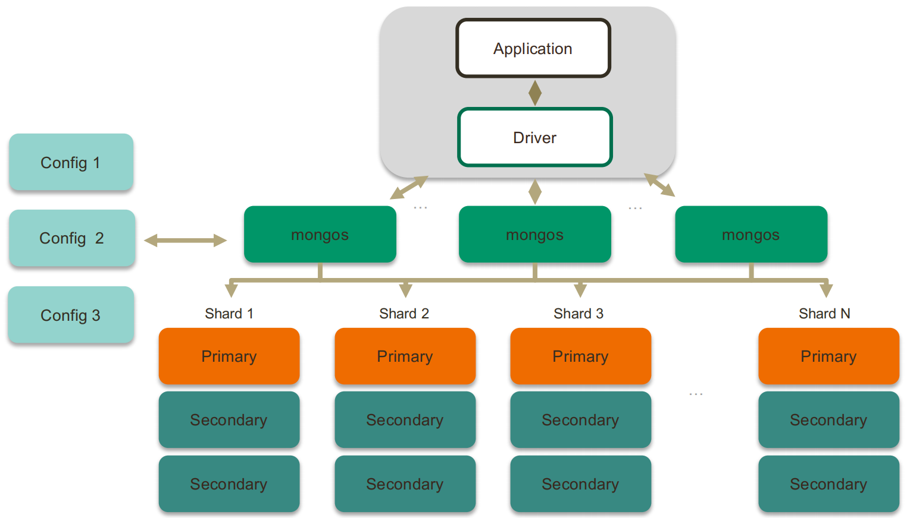

# 基本操作

```mysql
show databases;
use mock;
show collections;
show tables;  # 与 show collections 等价

db.fruit.drop(); # 删除一个集合，集合中的全部文档和索引都会被删除。

db.dropDatabase(); # 删除数据库, 数据库相应文件会被删除，磁盘空间将被释放
```


MongoDB中CRUD的操作格式如下：
```javascript
// 都是 db 关键字后跟着 collection 的名字，再跟着具体操作
db.<集合>.insertOne(<JSON对象>)
db.<集合>.insertMany([<JSON 1>, <JSON 2>, …<JSON n>])
```

## 增加数据

在增加数据前**无需提前创建**对应的collection：


```javascript
// 增加单条数据
db.fruit.insertOne({name: "apple"}) 

// 一次增加多条数据
db.fruit.insertMany([
  {name: "banana"},
  {name: "pear"},
  {name: "orange"}
])
```


## 查询

与其它 NoSQL 数据库查询时必须提供主键（PK）不同，MongoDB 具备强大的查询能力，能够支持基于复杂条件的查询操作

```javascript
// 不限制任何条件，查询 fruit collection 中的所有数据
db.fruit.find()
```


```javascript
// 单条件查询，查询name是pear的文档
db.fruit.find({name: 'pear'})
```


```javascript
// 多条件or查询
db.fruit.find({$or: [{name: 'apple'}, {name: 'banana'}]})
```


其它查询示例如下：

```javascript
// 多条件and查询
db.movies.find({$and: [{"title": "Batman"}, {"category": "action"}]}) 

// and查询的另一种形式
db.movies.find({"year": 1989, "title": "Batman"}) 

//按正则表达式查找
db.movies.find({"title": /^B/}) 
```

### 子文档查询

先增加一条具有子文档的记录：

```javascript
db.fruit.insertOne({
	name: "apple",
	from: {
		country: "China",
		province: "Guangdon"
	}
})
```

有两种跟子文档查询相关的查询命令：

```javascript
// 查询条件是from子文档下的country字段为China的记录，可以match到上面增加的数据
db.fruit.find({"from.country": "China"})

// 查询条件是整个from子文档是{country: "China"}的记录，与上面增加的数据不match，因为上面的数据还有province字段
db.fruit.find({"from": {country: "China"}})

// 可以match到上面增加的数据
db.fruit.find({"from": {country: "China", province: "Guangdon"}})
```


### 搜索数组

先增加两条具有数组类型字段的文档：

```javascript
db.fruit.insert([
	{ "name" : "Apple", color: ["red", "green" ] },
	{ "name" : "Mango", color: ["yellow", "green"] }
])
```

以数组类型的字段作为条件进行查询：

```javascript
db.fruit.find({color: "red"})

db.fruit.find({$or: [{color: "red"}, {color: "yellow"}]})
```


### 搜索数组中的复杂对象

增加一个文档，其数组中的值是复杂对象：

```javascript
db.movies.insertOne({
	"title": "Raiders of the Lost Ark",
	"filming_locations": [ 
		{"city": "Los Angeles", "state": "CA", "country": "USA"},
		{"city": "Rome", "state": "Lazio", "country": "Italy"},
		{"city": "Florence", "state": "SC", "country": "USA"}
	] 
})
```

查找城市是 Rome 的记录：

```javascript
db.movies.find({"filming_locations.city": "Rome"})
```


如果要使用数组中对象的多个字段作为查询条件，需要利用`$elemMatch`关键字。

下面命令查询city是Rome，且country是USA的文档：

```javascript
// $elemMatch 操作符用于在数组字段中查找同时满足指定条件的单个元素。
// 也就是说，它要求数组中的某个元素必须同时包含 city 为 "Rome" 且 country 为 "USA" 的字段值。
db.movies.find({
	"filming_locations": {
		$elemMatch: {"city": "Rome", "country": "USA"}
	}
})
```


```javascript
// 这种查询方式不要求这两个条件必须同时满足于同一个数组元素。
db.movies.find({
	"filming_locations.city": "Rome",
	"filming_locations.country": "USA"
})
```

### 投影(projection)

```javascript
// find方法的第一个参数是查询条件，第二个参数是投影字段的设置
// _id字段默认是一定会被查出的，所以该命令明确指定不查询_id字段
db.fruit.find({}, {_id: 0, name: 1})
```


## 删除文档

`remove` 命令需要配合查询条件使用，匹配查询条件的的文档会被删除。

指定一个**空文档条件**会删除所有文档。

示例：

```javascript
// 删除a等于1的记录
db.testcol.remove({a: 1}) 

// 删除a小于5的记录
db.testcol.remove({a: {$lt: 5}}) 

// 删除所有记录
db.testcol.remove({}) 

// 命令报错
db.testcol.remove() 
```


## 更新文档

Update 操作执行格式：`db.<集合>.update(<查询条件>, <更新字段>)`。

先增加一些测试数据：
```javascript
db.fruit.insertMany([
	{name: "apple"},
	{name: "pear"},
	{name: "orange"}
])
```

更新一条文档记录：

```javascript
db.fruit.updateOne({name: "apple"}, {$set: {from: "China"}})
```


使用 updateOne 表示无论条件匹配多少条记录，始终只更新第一条。

使用 updateMany 表示条件匹配多少条就更新多少条。

update操作的一些指令：

```javascript
$set/$unset
$push  				// 增加一个对象到数组底部
$pushAll    	// 增加多个对象到数组底部
$pop					// 从数组底部删除一个对象
$pull					// 如果匹配指定的值，从数组中删除相应的对象
$pullAll		 	// 如果匹配任意的值，从数据中删除相应的对象
$addToSet  		// 如果不存在则增加一个值到数组
```


# 复制集

MongoDB 复制集能够保障数据库服务具备高可用性。当有数据写入主节点(PRIMARY)后，这些数据会快速复制到集群内的各个从节点(SECONDARY)。一旦负责接收写入操作的主节点出现故障，复制集将自动进行选举，迅速选出一个新的节点来替代故障主节点，从而确保服务的持续稳定运行。

MongoDB 复制集在达成高可用性目标的基础上，还具备了多项额外优势：

- **高效数据分发**：借助复制集，数据能够在不同区域之间实现快速精准的复制。这种机制使得数据能更贴近不同区域的用户，极大地减少了远程区域的读延迟，显著提升了数据读取的响应速度与效率。
- **读写分离**：复制集支持将不同类型的操作负载合理分配到不同的节点上。写操作在主节点执行，读操作则可以分流到从节点处理，有效平衡了各节点的工作负载，提高了整个系统的处理能力和并发性能。
- **可靠异地容灾**：当某个数据中心遭遇故障时，复制集能够凭借其自动故障转移和节点选举机制，迅速切换至异地的备用节点继续提供服务。

在 MongoDB 复制集的架构设计里，要求所包含的服务器数量为**奇数**，建议一个复制集中包含3个节点。

## 如何实现数据复制？

只有主节点能受理写操作。

修改操作到达主节点后，其对数据的操作会被记录为 **oplog**。

从节点借助在主节点打开的 tailable 游标持续获取新的 oplog，并在自身数据上回放，从而与主节点保持数据一致。


一般来说，在网络状况良好、负载较低、数据量较小的理想情况下，数据同步时间可以在毫秒级别(10ms以内)。

## 选举主节点

1. 具有投票权的节点之间两两互相发送心跳；
   
2. 当5次心跳未收到时判断为节点失联；
3. 如果失联的是主节点，从节点会发起选举，选出新的主节点；
4. 选举基于 **RAFT**一致性算法 实现，选举成功的必要条件是大多数投票节点存活；

# 聚合框架

从效果而言，聚合框架(Aggregation Framework)相当于SQL查询中的**GROUP BY**和**LEFT OUTER JOIN**等操作。

### MQL 常用步骤与 SQL 对比

#### 1

```javascript
db.users.aggregate([
  {$match: {gender: ’’男”}}, 
  {$skip: 100}, 
  {$limit: 20}, 
  { $project: {
		'名': '$first_name',
		'姓': '$last_name'
	}}
]);
```

相当于

```mysql
SELECT FIRST_NAME AS `名`, LAST_NAME AS `姓` FROM Users
WHERE GENDER = '男' SKIP 100 LIMIT 20
```

#### 2

```javascript
db.users.aggregate([
	{$match: {gender: '女'}},
	{$group: {
		_id: '$DEPARTMENT’,
		emp_qty: {$sum: 1}
	}},
	{$match: {emp_qty: {$lt: 10}}}
]);
```

相当于

```sql
SELECT DEPARTMENT, COUNT(NULL) AS EMP_QTY FROM Users
WHERE GENDER = '女'
GROUP BY DEPARTMENT HAVING
COUNT(*) < 10
```

# 模型设计

JSON文档模型通过**内嵌数组**或**引用字段**来表示关系。

MongoDB 中一个文档最大只能是 **16MB**。

### 1:1 和 1:N

```json
{
 	name: "Jack",
	company: ”Tencent"
	title: " CTO",
	portraits: {       // 1:1 关系以内嵌为主
		mimetype: xxx 
		data: xxxx
	}，
	addresses: [      // 1:N 关系同样以内嵌为主
		{ type: home, … },
		{ type: work, … }
	] 
}
```

### N:N

```javascript
{
 	name: "Jack",
	company: ”Tencent"
	title: " CTO",
	portraits: {       
		mimetype: xxx 
		data: xxxx
	}，
	addresses: [      
		{ type: home, … },
		{ type: work, … }
	],
  groups: [ // 通过冗余来实现 N:N 
		{name: ”Friends”},
		{name: ”Surfers”},
	]
}
```

使用内嵌来表示`1-1`，`1-N` 和 `N-N`的关系对读操作通常有优势（减少关联）。

但直接将Group的值内嵌进Contact对象中会导致大量数据冗余，当要修改某个Group的值时需要遍历Contact中所有的历史文档记录。而且也不好对Group的值进行管理(例如增加新的Group值，用户也无法通过下拉组件选择一个恰当的Group值)。

正确的设计是将Group的值存储在一个单独的集合中，然后用 id 关联：

```json
// Groups 集合
{
  group_id
 	name
}

// Contacts 集合
{
 	name: "Jack",
	company: ”Tencent"
	title: " CTO",
	portraits: {       
		mimetype: xxx 
		data: xxxx
	}，
	addresses: [      
		{ type: home, … },
		{ type: work, … }
	],
  group_ids: [1，2，3…] // 这里存的是Groups集合中的id的值
}
```

可以通过 `$lookup` 一次查询多个集合中的数据(类似关联)。但在应用端分两次查询Contacts和Groups的数据也是可以的。

利用 `$lookup`模仿关联查询多表的数据 ：

```json
db.contacts.aggregate([
  {
    $lookup:
    {
      from: "groups",
      localField: "group_ids",
      foreignField: "group_id",
      as: "groups"
    }
  }
])
```

### 优化

对于不是经常使用的数据，也应该采用引用的方式。

例如，基础信息查询(不含头像)和头像查询的比例为`9:1`，使用引用方式，把头像数据放到另外一个集合，可以显著提升90%的查询效率。

```json
// Portraits
{
	_id: 123,
	mimetype: “xxx”,
	data: ”xxxx…”
}

// Contacts 集合
{
 	name: "Jack",
	company: ”Tencent"
	title: " CTO",
	portrait_id: 123，// 指向 Portraits 集合中的文档记录
	addresses: [      
		{ type: home, … },
		{ type: work, … }
	],
  group_ids: [1，2，3…]
}
```

### 一个案例

```json
{ 
  "_id" : "20160101050000:CA2790",  // 注意这里的_id，它的值可以指定，可以用一个组合值，此处是时间戳+航班号
  "icao" : "CA2790", 
  "callsign" : "CA2790", 
  "ts" : ISODate("2016-01-01T05:00:00.000+0000"), 
  "events" : {
    "a" : 31418, 
    "b" : 173, 
    "p" : [115, -134], 
    "s" : 91, 
    "v" : 80
  }
}
```

这种文档结构会导致文档数量非常大，造成数据量存储空间非常大(包括数据和索引)。

一架飞机一个小时的数据全部存储在一个文档中，每一个文档对应60个event，这种方案叫做分桶设计：

```json
{ 
  "_id" : "20160101050000:WG9943", 
  "icao" : "WG9943", 
  "ts" : ISODate("2016-01-01T05:00:00.000+0000"), 
  "events" : [
    {
      "a" : 24293, 
      "b" : 319, 
      "p" : [41, 70], 
      "s" : 56, 
      "t" : ISODate("2016-01-01T05:00:00.000+0000“)
    }, 
    {
      "a" : 33663, 
      "b" : 134, 
      "p" : [-38, -30], 
     	"s" : 385, 
      "t" : ISODate("2016-01-01T05:00:01.000+0000“)
    }, 
    ...
  ]
}
```

这样文档数减少为原来的1/60，数据量也降低了很多(因为避免存储了很多公共的冗余数据)，索引占用的空间也减少为原来的1/60。

分桶设计适合于物联网、时序数据等场景。这些场景数据点采集频繁，数据量太多。利用文档内嵌数组，将一个时间段的数据聚合到一个文档里。大量减少文档数量，大量减少索引占用空间。

### 第二个案例

bad case：
```json
{
  title: "Dunkirk",
  ...
  release_USA: "2017/07/23",
  release_UK: "2017/08/01",
  release_France: "2017/08/01",
  release_Festival_San_Jose: "2017/07/22"
}
```

good case:

```json
{
  title: "Dunkirk",
  ...
  releases: [
    { country: "USA", date: "2017/07/23"},
    { country: "UK", date: "2017/08/01"},
    { country: "release_France", date: "2017/08/01"}
  ]
}
```

# 事务

### writeConcern

writeConcern 决定一个写操作落到多少个节点上才算成功:

1. **0：**发起写操作，不关心是否成功；
2. **1~最大节点数：**写操作需要被复制到指定节点数才算成功；
3. **majority：**写操作需要被复制到大多数节点上才算成功。

```javascript
db.test.insert(
  {count: 1}, 
  {writeConcern: {w: "majority"}}
)
```

### journal

MongoDB中的journal就是WAL预写日志。当设置为true时表示写操作落到 journal 文件中才算成功。

### readPreference

readPreference 决定使用哪一个节点来满足正在发起的读请求：

1. **primary:** 只选择主节点；
2. **primaryPreferred：**优先选择主节点，如果不可用则选择从节点；
3. **secondary：**只选择从节点；
4. **secondaryPreferred：**优先选择从节点，如果从节点不可用则选择主节点；
5. **nearest：**选择最近的节点；

```javascript
db.test.find({a: 123})
  		.readPref(“secondary”)
```

### readConcern

readConcern 决定这个节点上的数据哪些是可读的：

1. **available：**读取所有可用的数据;
2. **local：**读取所有可用且属于当前分片的数据;
3. **majority：**读取在大多数节点上提交完成的数据;
4. **linearizable：**可线性化读取文档;
5. **snapshot：**读取最近快照中的数据;

默认值是local。在复制集中 local 和 available 是没有区别的。两者的区别主要体现在分片集上

一个 chunk x 正在从 shard1 向 shard2 迁移；如果readConcern是available，则chunk x移动到shard2后就能被读取(移动chunk是有一个过程的)。但如果readConcern是local，chunk x只有在真正属于shard2后才能被读取。


**writeConcern + readConcern majority 可以解决读写一致性问题！！！！就像cassandra一样。**


## 多文档事务

MongoDB不仅支持复制集多表多行的事务，而且还支持**分片集群**多表多行事务。

不要毫无节制地使用事务。相反，对事务的使用原则应该是：能不用尽量不用。

事务 = 锁，会造成额外开销，影响性能。

事务样例：

```javascript
try (ClientSession clientSession = client.startSession()) {
  clientSession.startTransaction();  // 开启事务
  collection.insertOne(clientSession, docOne);
  collection.insertOne(clientSession, docTwo);
  clientSession.commitTransaction();  // 提交事务
}
// 确保了事务的原子性
```

# 横向扩展能力

MongoDB 集群起步时可用**单个**复制集，待数据量增大，再将其扩展为多分片集群。

单复制集阶段无需 `mongos` 和 `config` 进程，需扩展为分片集群时，届时启动这两个进程也来得及。

分片架构支持海量数据和无缝扩容:



1. 需要的时候无缝扩展
2. 应用全透明
3. 多种数据分布策略
4. 轻松支持 TB – **PB** 数量级

### Config

Config也是mongod进程组成的普通复制集架构，记录每个shard存储的数据范围。例如：

| Lower | Uppwer | Shard  |
| ----- | ------ | ------ |
| 0     | 1000   | Shard0 |
| 1001  | 2000   | Shard1 |

mongos 与 config 通常消耗很少的资源，可以选择低规格虚拟机。

### 数据节点

以复制集为单位，横向扩展，最大1024分片。分片之间数据不重复，所有分片在一起才可完整工作。

### 分片方式

1. 基于范围
   片键**范围查询**性能好，但可能造成热点。

2. 基于 Hash
   数据分布均匀，但范围查询效率低。

3. 基于 zone / tag

尽可能保证一个分片的数据量不要超过2TB，且所有索引数据可以加载到内存。

### Chunk

选择合适片键，片键的取值基数要大，并且片键要分布均匀。

在 MongoDB 的 sharding 集群中，平衡数据是以 chunk 为最小单位的。

在 MongoDB 里，无法直接预先配置具体的 chunk 数量，但可以通过**调整 chunk 大小**来间接影响 chunk 的数量。

```javascript
// 设置chunk大小为128MB
sh.setChunkSize(128)
```

chunk 的数量是随着数据量的增加动态增长的。随着数据的不断插入，当某个 chunk 的数据量超过了配置的 chunk 大小时，MongoDB 会自动将该 chunk 分裂成两个较小的 chunk。例如，假设你将 chunk 大小设置为 128MB，当一个 chunk 的数据量达到 128MB 时，MongoDB 会将其分裂为两个约 64MB 的 chunk（实际分裂可能不完全均匀）。

# 索引

从 MongoDB 的官方文档来看，单个集合理论上可以创建 **64** 个索引。MongoDB的索引底层使用B+树作为数据结构。

```javascript
db.human.createIndex(
  {
    firstName: 1, 
    lastName: 1, 
    gender: 1, 
    age: 1
  }
)
```

MongoDB支持多种类型的索引，包括：

1. 单键索引
2. **组合索引**
3. 地理位置索引
4. 全文索引
5. TTL索引
6. 哈希索引

### 创建组合索引的最佳方式

**ESR**原则

• 精确（Equal）匹配的字段放最前面

• **排序（Sort）条件放中间**

• **范围（Range）匹配的字段放最后面**

### _id列

在 MongoDB 中，每个文档中的 `_id` 字段会自动成为主键索引， `_id` 字段具有唯一性约束。

当你在 MongoDB 中创建一个新的集合时，即使没有显式地指定，MongoDB 也会自动为集合中每个文档的 `_id` 字段创建一个**唯一**索引。

由于 `_id` 字段上存在索引，通过 `_id` 进行查询可以非常高效。MongoDB 可以利用这个索引快速定位到特定的文档，避免全集合扫描，大大提高查询性能。

#### 回表

在 WiredTiger 存储引擎下，**每个索引(包括二级索引)**都会构建一个独立的 B 树。

在 MongoDB 中，当使用二级索引进行查询时，也存在类似 “回表” 的操作。

但是，在MongoDB中，即使采用_id索引查找文档，也需要有执行”回表“的过程。

这是因为，在 WiredTiger 存储引擎里，`_id` 索引和文档数据是**分开存储的**。`_id` 索引构建了一个 B 树结构，这个 B 树的每个节点包含 `_id` 值以及指向对应文档实际存储位置的**引用**信息。文档数据则以自身特定的组织方式存放在**其他地方**。在 `_id` 索引的 B 树中找到目标 `_id` 后，只能获取到该 `_id` 对应的文档存储位置信息，而不是完整的文档数据。所以，MongoDB 会根据这个位置信息，到存储文档数据的地方去读取完整的文档内容，这就类似关系型数据库中的 “回表” 操作。

在 MongoDB 里二级索引存储 `_id` 值而不是单纯的引用信息。主要有以下几个原因：

1. 文档存储位置的引用信息可能会随着数据库的运行而发生变化，比如进行数据压缩、磁盘空间整理或者数据库进行碎片整理等操作时，文档的物理存储位置可能会改变。
2. 在 MongoDB 的分片集群和副本集环境中，数据会分布在多个节点上。如果二级索引仅存储本地的引用信息，在进行数据迁移、故障转移等操作时，很难保证在不同节点和副本之间准确地定位到文档。

MongoDB 首先会在对应的二级索引结构（通常是 B 树）中查找满足查询条件的索引项。二级索引包含了索引字段的值以及对应的 `_id` 值。由于二级索引仅存储了索引字段和 `_id`，并不包含文档的完整数据，所以 MongoDB 需要根据前面获取的 `_id` 值，到 `_id` 主键索引对应的 B 树中查找完整的文档数据。通过 `_id` 快速定位到文档的实际存储位置并读取完整内容。

# MongoDB优势

MongoDB是**OLTP**数据库。原则上 Oracle 和 MySQL 能做的事情，MongoDB 都能做（包括 ACID 事务）

MongoDB的优势：

1. 开发效率高，JSON结构和对象模型更接近，开发代码量低。JSON的动态模型也更容易响应新的业务需求。
2. 多形性、动态性，可动态增加新字段。
3. 分布式、易扩展
4. 支持使用 JSON Schema 来规范数据模式。在保证模式灵活动态的前提下，提供数据治理能力。

当创建一个新的集合时，可以通过 `createCollection` 方法指定 JSON Schema 验证规则。

下面的示例，要求集合中的文档必须包含 `name` 字段，且 `name` 字段为字符串类型，同时可以**选择性地**包含 `age` 字段，`age` 字段必须为整数类型：

```javascript
// 创建集合并指定验证规则
db.createCollection("users", {
    validator: {
        $jsonSchema: {
            bsonType: "object",
            required: ["name"],
            properties: {
                name: {
                    bsonType: "string",
                    description: "must be a string and is required"
                },
                age: {
                    bsonType: "int",
                    description: "must be an integer if present"
                }
            }
        }
    }
});
```

# MongoDB VS Cassandra

- **Cassandra**：为写入吞吐量和全球扩展性优化，牺牲查询灵活性和事务能力。
- **MongoDB**：在保持NoSQL灵活性的同时，向传统数据库的强一致性和丰富功能靠拢。

#### **适用场景**

- **Cassandra更优场景**：
  - 高吞吐写入（如IoT设备日志、消息队列）。
  - 多数据中心部署（如全球化应用）。
  - 需要线性扩展且无复杂事务需求。
- **MongoDB更优场景**：
  - 快速迭代的业务（如初创公司MVP）。
  - 复杂查询和聚合分析（如用户行为分析）。
  - 需要事务支持的OLTP类应用。

我感觉如果是对于试错性的小规模MVP项目，且对项目时间比较敏感，可以考虑采用MongoDB。也不要考虑使用分片集群，就采用复制集即可。

其动态的JSON文档结构可以快速支持业务变化，又能支持复杂丰富的查询条件，可以快速上线应用。

# MongoDB VS MySQL

1. **避免技术霸权思维**：没有“万能数据库”，MongoDB和MySQL是互补而非替代关系。
2. **混合架构趋势**：现代系统常同时使用两者（如用MongoDB存用户行为日志，MySQL存订单数据）。
3. **长期成本考量**：MongoDB的灵活Schema可能在前3个月节省时间，但在第3年可能因技术债增加维护成本。

虽然MongoDB也支持事务，但MongoDB**单机**在开启事务后，其吞吐量通常为 MySQL 的 1/5~1/10（实测约 1k~2k TPS）。Mysql**单机**在高并发下事务吞吐量高（实测单机可达 10k+ TPS）。


#### **选择 MongoDB 的场景**

- **数据模型灵活**：需求频繁变化，文档结构动态扩展（如用户画像存储）。
- **海量数据**：海量数据写入（如日志、IoT传感器数据），且**事务需求低频**。

#### **选择 MySQL 的场景**

- **高频核心事务**：支付、库存管理等需要高TPS和强一致性。
