# 基本操作

```mysql
show databases;
use mock;
show collections;
show tables;  # 与 show collections 等价

db.fruit.drop(); # 删除一个集合，集合中的全部文档和索引都会被删除。

db.dropDatabase(); # 删除数据库, 数据库相应文件会被删除，磁盘空间将被释放
```

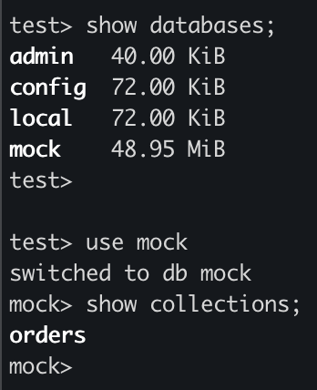

MongoDB中CRUD的操作格式如下：
```javascript
// 都是 db 关键字后跟着 collection 的名字，再跟着具体操作
db.<集合>.insertOne(<JSON对象>)
db.<集合>.insertMany([<JSON 1>, <JSON 2>, …<JSON n>])
```

## 增加数据

在增加数据前**无需提前创建**对应的collection：

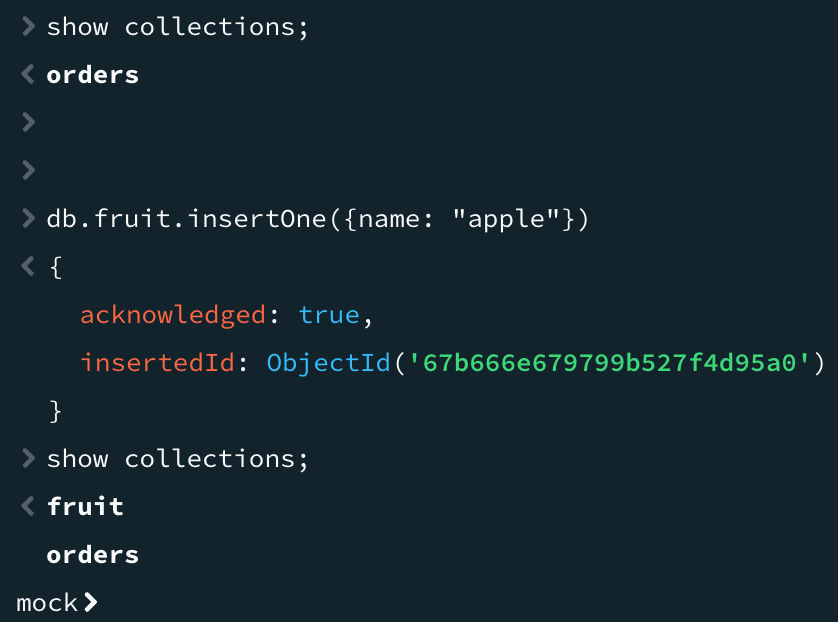

```javascript
// 增加单条数据
db.fruit.insertOne({name: "apple"}) 

// 一次增加多条数据
db.fruit.insertMany([
  {name: "banana"},
  {name: "pear"},
  {name: "orange"}
])
```

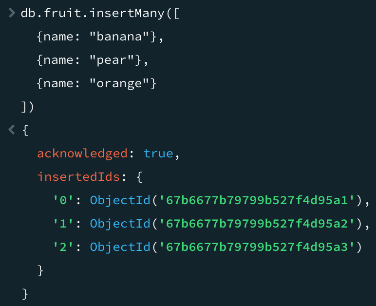

## 查询

与其它 NoSQL 数据库查询时必须提供主键（PK）不同，MongoDB 具备强大的查询能力，能够支持基于复杂条件的查询操作

```javascript
// 不限制任何条件，查询 fruit collection 中的所有数据
db.fruit.find()
```

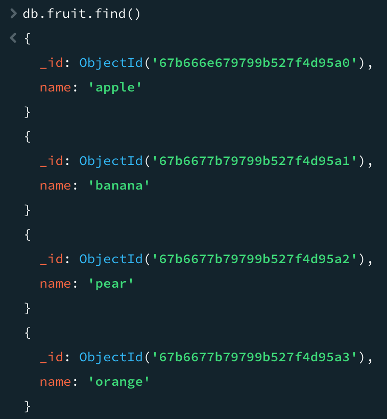

```javascript
// 单条件查询，查询name是pear的文档
db.fruit.find({name: 'pear'})
```

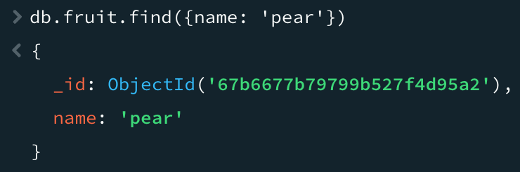

```javascript
// 多条件or查询
db.fruit.find({$or: [{name: 'apple'}, {name: 'banana'}]})
```

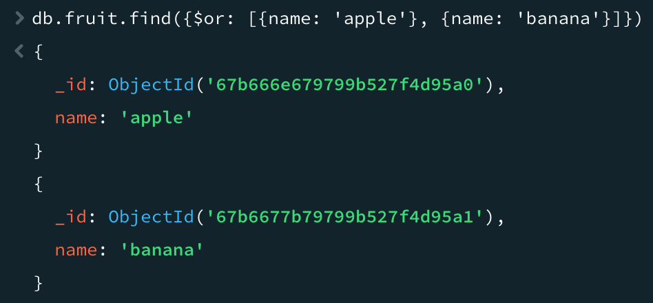

其它查询示例如下：

```javascript
// 多条件and查询
db.movies.find({$and: [{"title": "Batman"}, {"category": "action"}]}) 

// and查询的另一种形式
db.movies.find({"year": 1989, "title": "Batman"}) 

//按正则表达式查找
db.movies.find({"title": /^B/}) 
```

### 子文档查询

先增加一条具有子文档的记录：

```javascript
db.fruit.insertOne({
	name: "apple",
	from: {
		country: "China",
		province: "Guangdon"
	}
})
```

有两种跟子文档查询相关的查询命令：

```javascript
// 查询条件是from子文档下的country字段为China的记录，可以match到上面增加的数据
db.fruit.find({"from.country": "China"})

// 查询条件是整个from子文档是{country: "China"}的记录，与上面增加的数据不match，因为上面的数据还有province字段
db.fruit.find({"from": {country: "China"}})

// 可以match到上面增加的数据
db.fruit.find({"from": {country: "China", province: "Guangdon"}})
```

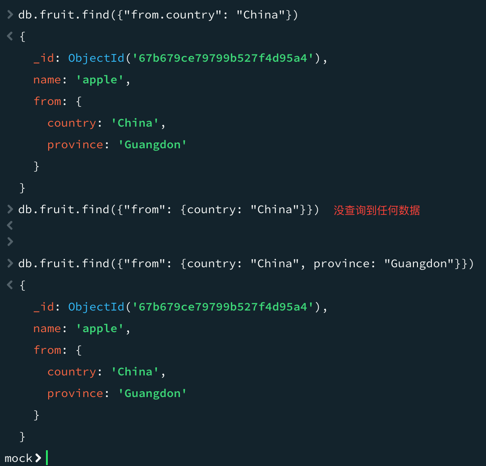

### 搜索数组

先增加两条具有数组类型字段的文档：

```javascript
db.fruit.insert([
	{ "name" : "Apple", color: ["red", "green" ] },
	{ "name" : "Mango", color: ["yellow", "green"] }
])
```

以数组类型的字段作为条件进行查询：

```javascript
db.fruit.find({color: "red"})

db.fruit.find({$or: [{color: "red"}, {color: "yellow"}]})
```

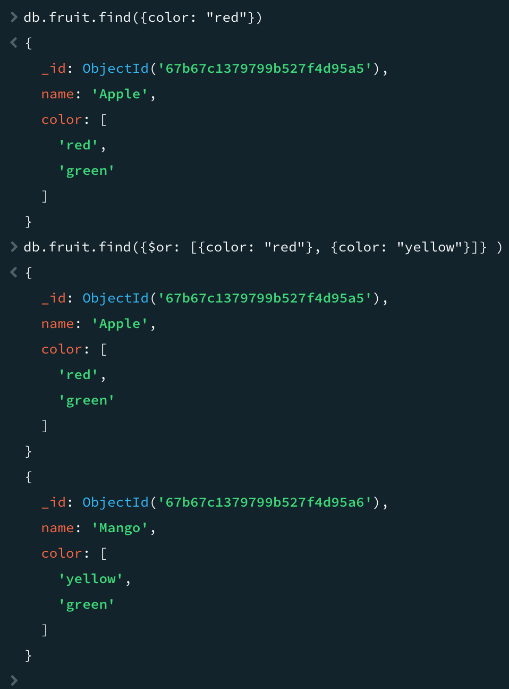

### 搜索数组中的复杂对象

增加一个文档，其数组中的值是复杂对象：

```javascript
db.movies.insertOne({
	"title": "Raiders of the Lost Ark",
	"filming_locations": [ 
		{"city": "Los Angeles", "state": "CA", "country": "USA"},
		{"city": "Rome", "state": "Lazio", "country": "Italy"},
		{"city": "Florence", "state": "SC", "country": "USA"}
	] 
})
```

查找城市是 Rome 的记录：

```javascript
db.movies.find({"filming_locations.city": "Rome"})
```

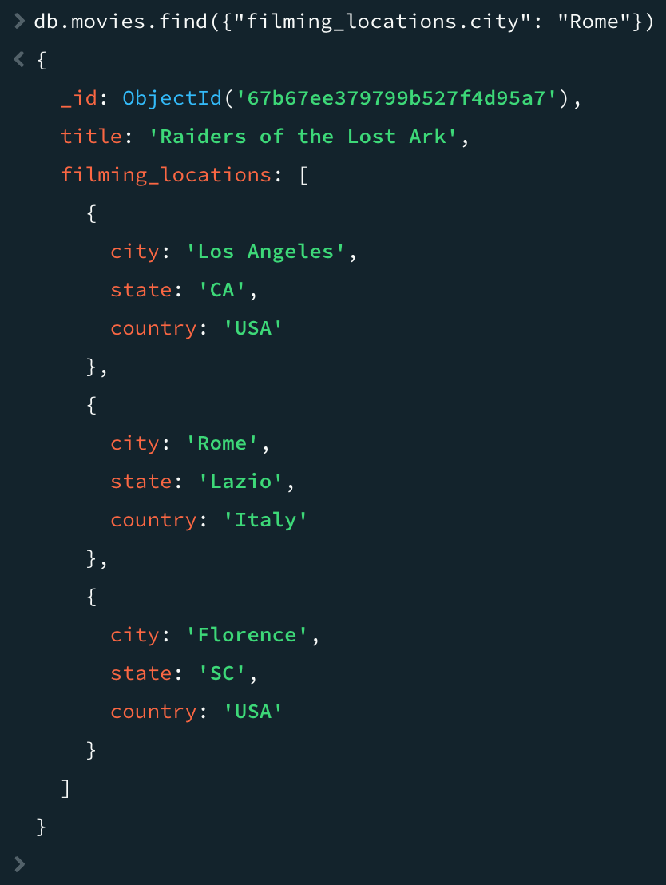

如果要使用数组中对象的多个字段作为查询条件，需要利用`$elemMatch`关键字。

下面命令查询city是Rome，且country是USA的文档：

```javascript
// $elemMatch 操作符用于在数组字段中查找同时满足指定条件的单个元素。
// 也就是说，它要求数组中的某个元素必须同时包含 city 为 "Rome" 且 country 为 "USA" 的字段值。
db.movies.find({
	"filming_locations": {
		$elemMatch: {"city": "Rome", "country": "USA"}
	}
})
```

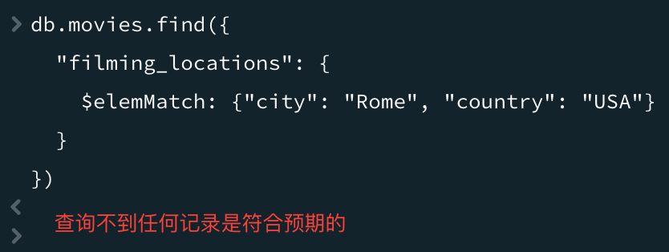

```javascript
// 这种查询方式不要求这两个条件必须同时满足于同一个数组元素。
db.movies.find({
	"filming_locations.city": "Rome",
	"filming_locations.country": "USA"
})
```

### 投影(projection)

```javascript
// find方法的第一个参数是查询条件，第二个参数是投影字段的设置
// _id字段默认是一定会被查出的，所以该命令明确指定不查询_id字段
db.fruit.find({}, {_id: 0, name: 1})
```

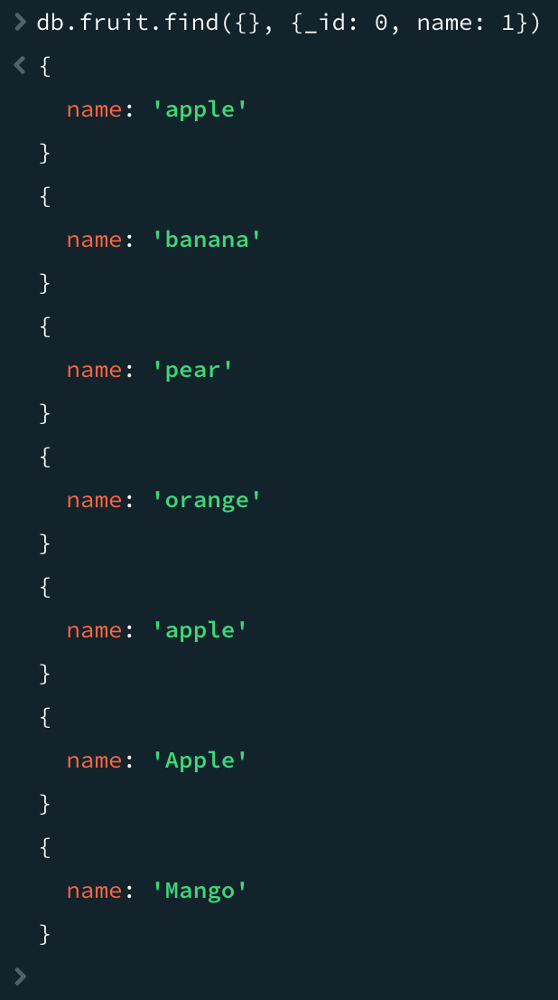

## 删除文档

`remove` 命令需要配合查询条件使用，匹配查询条件的的文档会被删除。

指定一个**空文档条件**会删除所有文档。

示例：

```javascript
// 删除a等于1的记录
db.testcol.remove({a: 1}) 

// 删除a小于5的记录
db.testcol.remove({a: {$lt: 5}}) 

// 删除所有记录
db.testcol.remove({}) 

// 命令报错
db.testcol.remove() 
```

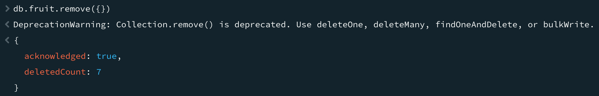

## 更新文档

Update 操作执行格式：`db.<集合>.update(<查询条件>, <更新字段>)`。

先增加一些测试数据：
```javascript
db.fruit.insertMany([
	{name: "apple"},
	{name: "pear"},
	{name: "orange"}
])
```

更新一条文档记录：

```javascript
db.fruit.updateOne({name: "apple"}, {$set: {from: "China"}})
```

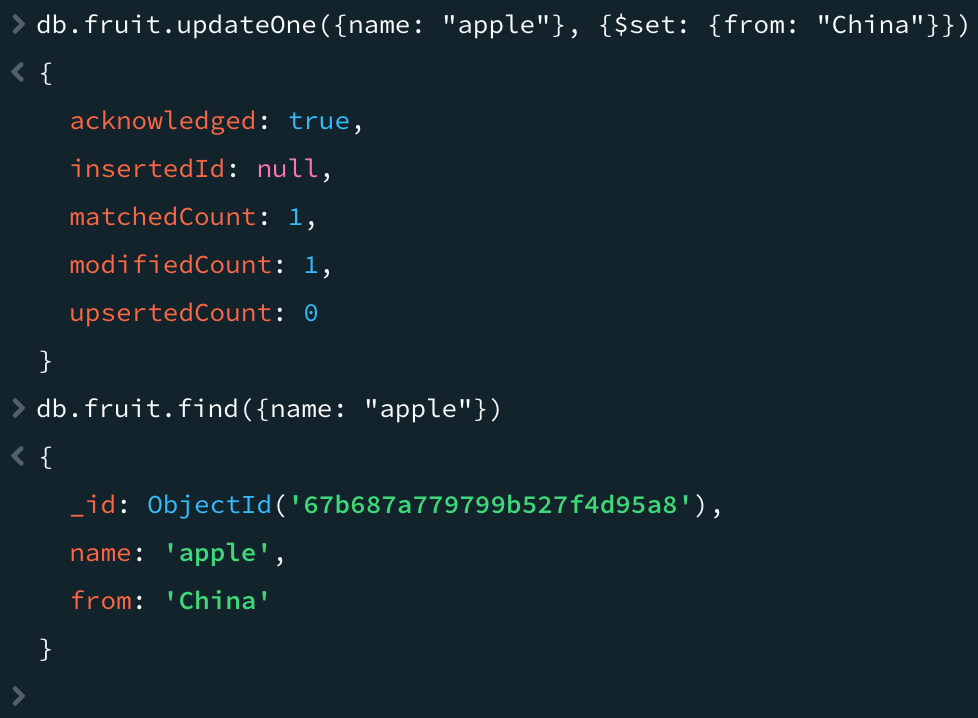

使用 updateOne 表示无论条件匹配多少条记录，始终只更新第一条。

使用 updateMany 表示条件匹配多少条就更新多少条。

update操作的一些指令：

```javascript
$set/$unset
$push  				// 增加一个对象到数组底部
$pushAll    	// 增加多个对象到数组底部
$pop					// 从数组底部删除一个对象
$pull					// 如果匹配指定的值，从数组中删除相应的对象
$pullAll		 	// 如果匹配任意的值，从数据中删除相应的对象
$addToSet  		// 如果不存在则增加一个值到数组
```


# 复制集

MongoDB 复制集能够保障数据库服务具备高可用性。当有数据写入主节点(PRIMARY)后，这些数据会快速复制到集群内的各个从节点(SECONDARY)。一旦负责接收写入操作的主节点出现故障，复制集将自动进行选举，迅速选出一个新的节点来替代故障主节点，从而确保服务的持续稳定运行。

MongoDB 复制集在达成高可用性目标的基础上，还具备了多项额外优势：

- **高效数据分发**：借助复制集，数据能够在不同区域之间实现快速精准的复制。这种机制使得数据能更贴近不同区域的用户，极大地减少了远程区域的读延迟，显著提升了数据读取的响应速度与效率。
- **读写分离**：复制集支持将不同类型的操作负载合理分配到不同的节点上。写操作在主节点执行，读操作则可以分流到从节点处理，有效平衡了各节点的工作负载，提高了整个系统的处理能力和并发性能。
- **可靠异地容灾**：当某个数据中心遭遇故障时，复制集能够凭借其自动故障转移和节点选举机制，迅速切换至异地的备用节点继续提供服务。

在 MongoDB 复制集的架构设计里，要求所包含的服务器数量为**奇数**，建议一个复制集中包含3个节点。

## 如何实现数据复制？

只有主节点能受理写操作。

修改操作到达主节点后，其对数据的操作会被记录为 **oplog**。

从节点借助在主节点打开的 tailable 游标持续获取新的 oplog，并在自身数据上回放，从而与主节点保持数据一致。

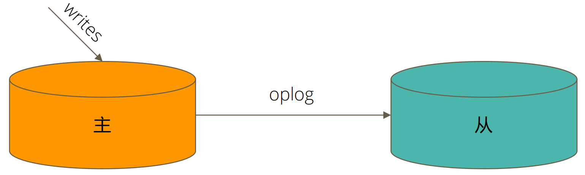

一般来说，在网络状况良好、负载较低、数据量较小的理想情况下，数据同步时间可以在毫秒级别(10ms以内)。

## 选举主节点

1. 具有投票权的节点之间两两互相发送心跳；
   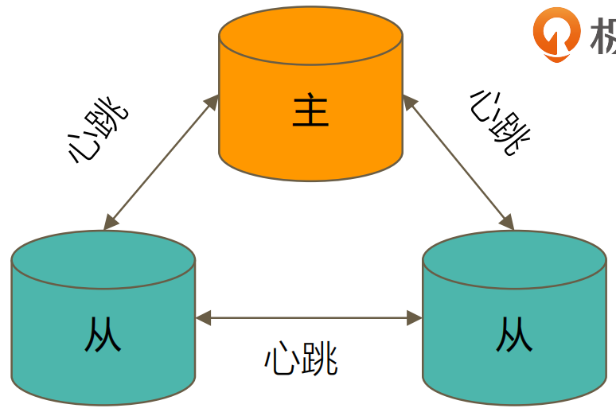
2. 当5次心跳未收到时判断为节点失联；
3. 如果失联的是主节点，从节点会发起选举，选出新的主节点；
4. 选举基于 RAFT一致性算法 实现，选举成功的必要条件是大多数投票节点存活；

