# 部署模式

## Local
只启动一个JVM进程，通过多线程的方式模拟Spark集群环境。

Local模式可以配置模拟Spark集群环境的线程数量, 即`Local[N]`或`Local[*]`。
1. N代表可以使用的线程数量，默认是1.
2. `Local[*]`: Run Spark locally with as many worker threads as 
logical cores on your machine.

在/etc/profile中配置如下环境变量：
-  SPARK_HOME: 表示Spark安装路径在哪里 
-  PYSPARK_PYTHON: 表示Spark想运行Python程序, 那么去哪里找python执行器 
-  JAVA_HOME: 告知Spark Java在哪里 
-  HADOOP_CONF_DIR: 告知Spark Hadoop的配置文件在哪里 
-  HADOOP_HOME: 告知Spark  Hadoop安装在哪里 


`pyspark`是一个交互式的解释器，可以在其中写python代码，并在spark中执行。默认`master = local[*]`。

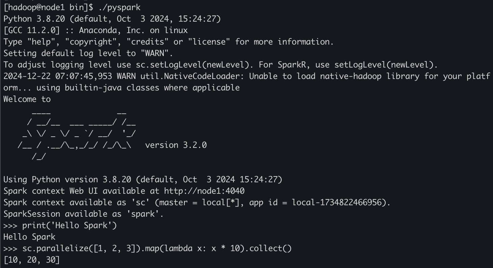

在 `http://node1:4040` 可以打开Spark Driver的web UI：

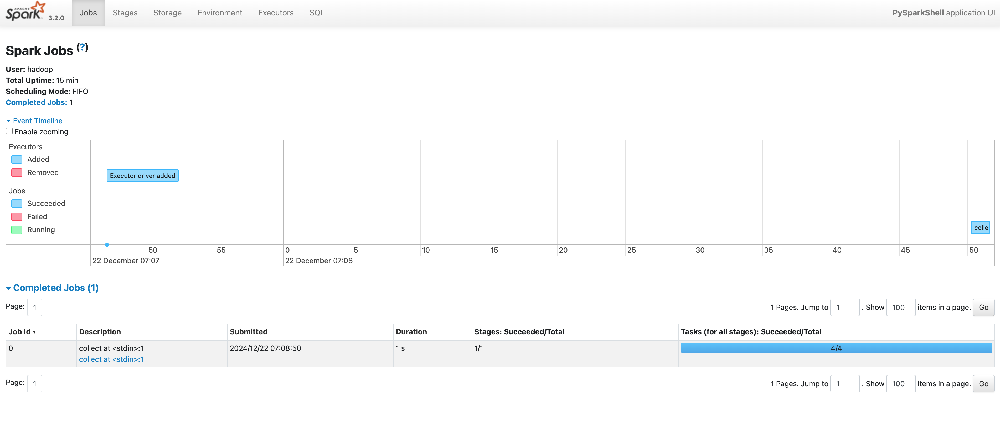

指定模拟的线程数：
```shell
./pyspark --master local[1]
```

除了python的交互式解释器外，spark还自带了可以执行scala(spark-shell)和R(sparkR)的交互解释器。

`spark-submit` 提价一个Job：
```shell
./spark-submit --master local[*] /export/server/spark-3.2.0-bin-hadoop3.2/examples/src/main/python/pi.py 10000
```
master选项表示在什么模式下运行，这里表示在Local模式下运行，如果是在Yarn模式运行，则应该写成`--master yarn`。

## StandAlone
利用anaconda创建python环境的命令，pyspark是环境的名字：

```shell
conda create -n pyspark python=3.8
```

启动spark的历史服务器：
```shell
./sbin/start-history-server.sh
```

启动spark的整个集群(包括Master和Worker两类进程，Master相当于Yarn中的ResourceManager，Worker相当于Yarn中的NodeManager)：
```shell
./sbin/start-all.sh
```

通过pyspark命令连接到StandAlone集群(集群地址可以在spark WebUI上查看)：
```shell
./pyspark --master spark://node1:7077
```

提交一个Spark**应用**到StandAlone集群：
```shell
./spark-submit --master spark://node1:7077 ../examples/src/main/python/pi.py 10000
```

### Master 和 Driver
在Spark StandAlone集群中，Master和Driver都有自己单独的Web UI:
1. Master的WebUI是 `http://node1:8080/`。
2. Driver的webUI是 `http://node1:4040/jobs/`。如果同时运行多个Application就会有多个Driver，则各个Driver的WebUI端口号会自动递增，4040、4041、4042、4043...。

向Spark StandAlone集群中提交程序并不是只创建一个Job，提交的Spark程序会对应一个Application。运行中的Application和运行完成的Application都可以在Master的WebUi上查看到：

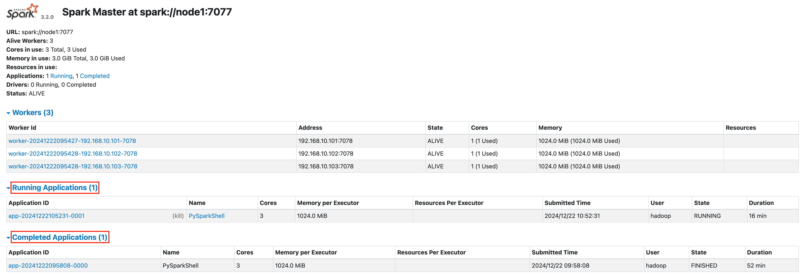

对于一个Application，会启动一个单独的**Driver**对其进行管理，Driver运行在Master进程之内。如果要查看一个Application的详细信息，可以跳转到其Driver的WebUI页面查看。对于运行中的Application，可以通过如下页面中的链接跳转到其Dirver的WebUI页面：

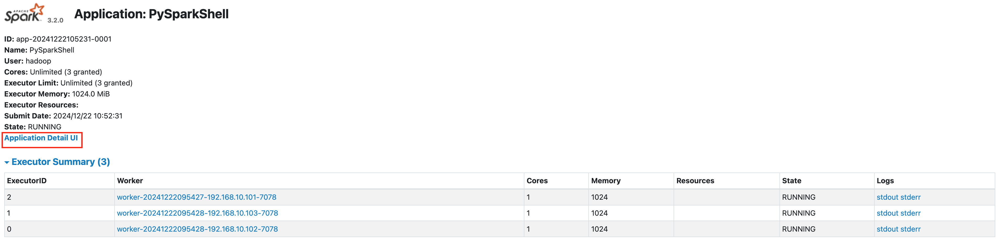

一个Application中会包含多个Job，每个Action类型的算子都会创建一个Job。一个Application中包含哪些Job和每个Job的详细信息可以在其Driver的WebUI查看：

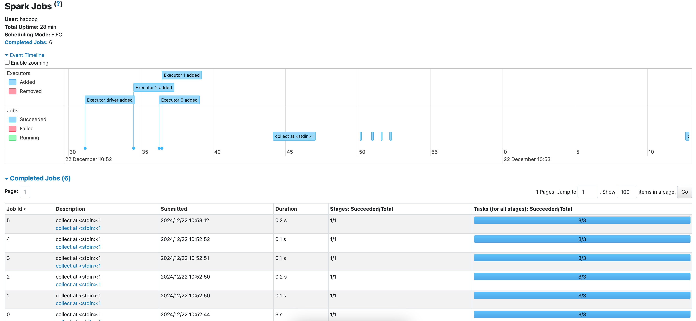

当一个Application执行完成退出后，其对应的Driver和Executor也会跟着退出。所以其Driver对应的WebUI在Application执行结束后就无法再打开了。

但Master的WebUI是能够一直访问的。

对于那些已经完成的Application，该如何查询其详细信息呢？这就可以通过Spark的HistoryServer查看已完成的Application的详细信息。

HistoryServer的地址是：`http://node1:18080/`：

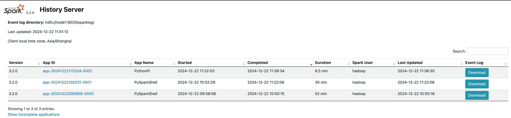

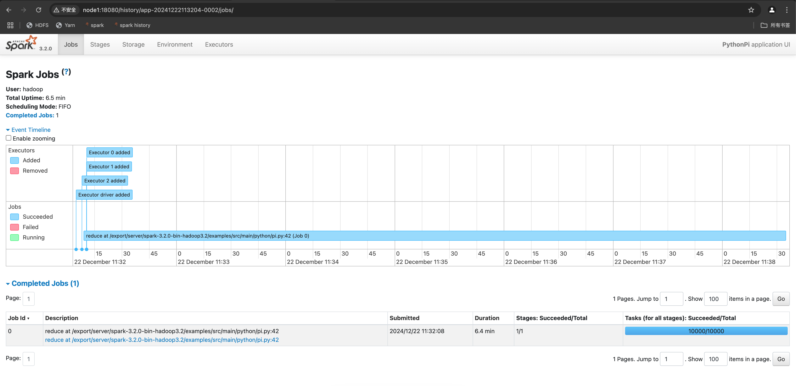

对于Spark StandAlone集群，并没有依赖Yarn，但使用到了HDFS。


## Yarn
确保如下两个环境变量被正确配置到`spark-env.sh`文件中。
1. HADOOP_CONF_DIR
2. YARN_CONF_DIR

配置完这两个环境变量后，Spark客户端就能知道Yarn集群的全部信息。

pyspark连接到Yarn集群：

```shell
./bin/pyspark --master yarn

```
通过Yarn页面中的 “ApplicationMaster” 链接就能跳转到Spark Driver的WebUI。

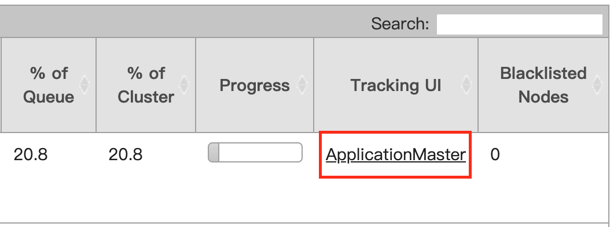

提交一个Spark应用到Yarn集群：
```shell
./bin/spark-submit --master yarn examples/src/main/python/pi.py 100
```

如果已经有了Yarn集群，想要在其上运行Spark应用真是非常的简单。只需要随便找一个Yarn集群中的服务器，解压Spark安装包，配置好相应的环境变量，就可以向Yarn集群中提交Spark应用程序了。


### client 模式
```shell
./bin/spark-submit \
--master yarn \
--deploy-mode client \
--driver-memory 512m \
--executor-memory 512m \
--num-executors 3 \
--total-executor-cores 3 \
examples/src/main/python/pi.py 100 \
```

虽然是以client的模式运行，但YARN还是要给ApplicationMaster分配一个container，所以client模式并不能节省Driver需要的资源。

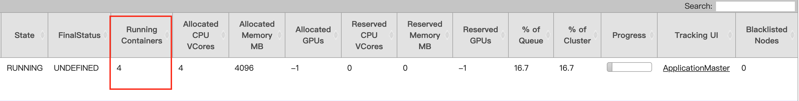

client模式最大的好处是可以直接在控制台就能看到日志：

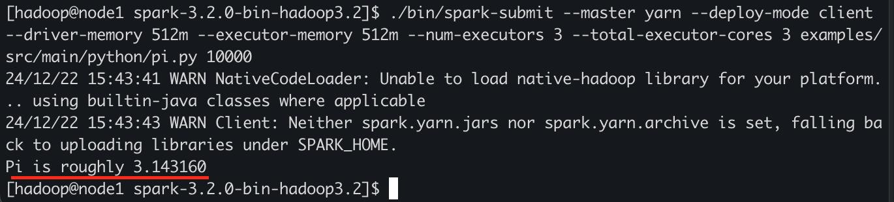


### cluster 模式

将deploy-mode从client改成cluster，在terminal中无法查看到结果：

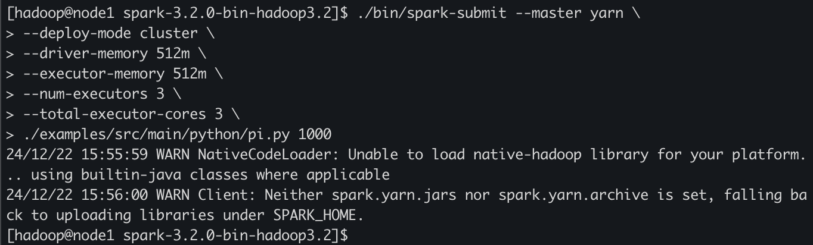

结果可以在yarn的日志中找到：

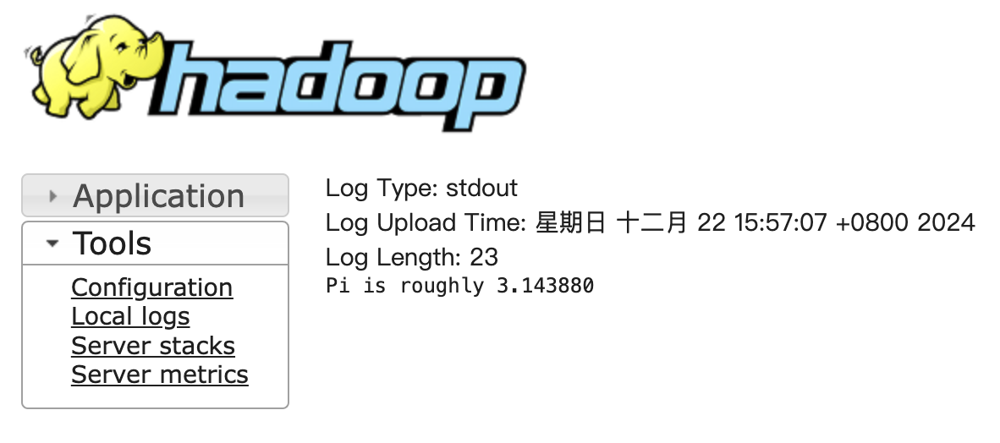

cluster 模式更稳定，性能也更好。


